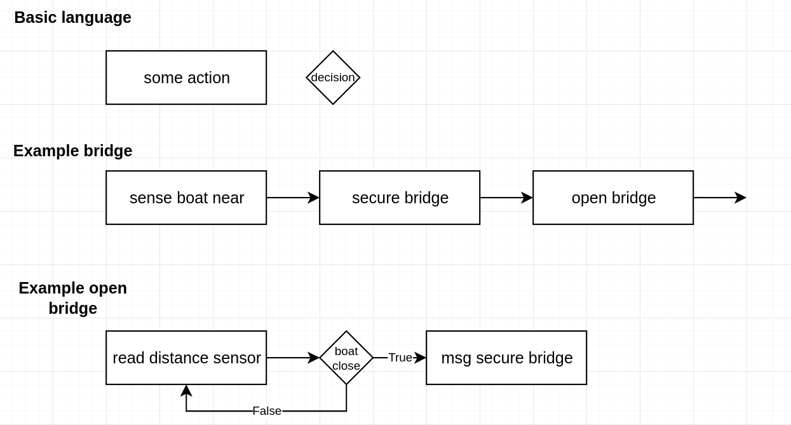

# What is programming? 

Consider the following code: 

```cpp
#include <stdio.h>
#include <stdlib.h>

int main(void) {
    int guess; 
    int answer;
    answer = 5;
    printf("Pick a number between 1 and 10\n");
    scanf("%d", &guess);
    if (guess == answer) {
        printf("Winner winner chicken dinner!!!!");
    } else {
        printf("lol!");
    }
    return 0
}
```

I want you to read each line of code 

## What is design (specifically for code)

Before we build something, we should think through what we are going to build. Not doing so is more difficult that just pushing your brain through it. 



In this simplified idea of specification writing, we are going to document what we are going to do with boxes and arrows. 

A simple box represents some action. That is, you, the system, your code, whatever, is actively doing something. You might need to assign a variable, your robot might need to apply power to a motor, or a user might need to press a button. Any of these can be button presses. 

A diamond is where you need to consider some sort of decision before moving to the next action. Is your robot really close to a wall? Does your user have to wait for the door to open before walking in? 