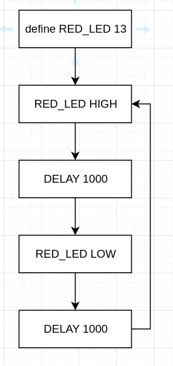

# Programming blinking lights 

## My design



So, we need to define the RED_LED as pin 13. We don't know how to do this at the moment, so we are just going to remember it and do it manually. 

Then our code turns the RED_LED on (sets to high), waits a second, turns RED_LED off, waits a second, goes to turning the RED_LED off again. 

## Keywords and concepts

Programming is full of keywords and concepts that we need to learn. Here are some for today

- [setup](https://www.arduino.cc/reference/en/language/structure/sketch/setup/)
- [loop](https://www.arduino.cc/reference/en/language/structure/sketch/lopp/)
- [pinMode](https://www.arduino.cc/reference/en/language/functions/digital-io/pinmode/)
- [OUTPUT](https://www.arduino.cc/reference/en/language/variables/constants/inputoutputpullup/)
- [digitalWrite](https://www.arduino.cc/reference/en/language/functions/digital-io/digitalwrite/)
- [delay](https://www.arduino.cc/reference/en/language/functions/time/delay/)


## My code


```cpp
void setup() {
  pinMode(13, OUTPUT);
}

void loop() {
  digitalWrite(13, HIGH);
  delay(1000);
  digitalWrite(13, LOW);
  delay(1000);
}
```


## Challenge 

Design and build a simulation which has at least 5 LEDs that fire in different patterns. 
