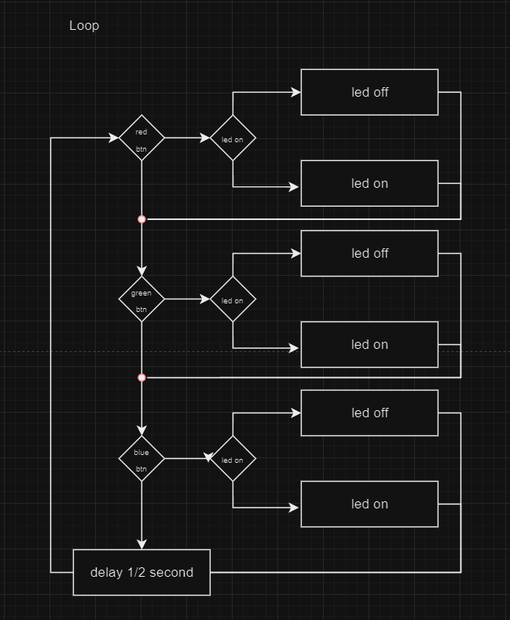

# TLDR: Conditions

Conditions in the if or else if statements can be any expression that evaluates to a boolean value (true or false).
These structures can control the flow of your Arduino program, allowing you to react to input, make decisions, and produce different outputs based on varying conditions.

Parentheses () are used to enclose the condition being tested, and curly braces {} enclose the block of code to execute.
It's essential to ensure your conditions are logically correct and cover all possible scenarios you want your program to handle.

## if Statement

- Problem Being Resolved: Execute a block of code if a specific condition is true.
- Syntax:
```cpp
if (condition) {
  // code to execute if condition is true
}
```

## else Statement

- Problem Being Resolved: Execute a block of code if the condition in the if statement is false.
- Syntax:
```cpp
if (condition) {
  // code to execute if condition is true
} else {
  // code to execute if condition is false
}
```

## else if Statement

- Problem Being Resolved: Test multiple conditions in sequence and execute a block of code as soon as one of the conditions evaluates to true.
- Syntax:
```cpp
if (condition1) {
  // code to execute if condition1 is true
} else if (condition2) {
  // code to execute if condition2 is true
} else {
  // code to execute if none of the above conditions is true
}
```

## Practice makes perfect

### Print a message when a button is pressed for the first time.

Objective: Design and write a program that prints "Button Pressed!" over serial only the first time the button is pressed. Subsequent presses should not print the message.
Hints: Use a boolean variable to keep track of whether the button has been pressed before.

```cpp

void setup(){
  Serial.begin(9600);
  bool foo = true;
  bool bar = false;
  Serial.println(foo);
  Serial.println(bar);
}
```


### Toggle an LED on and off with a button press.

Objective: Design and write a program that toggles an LED on and off each time a button is pressed.
Hints: Use a boolean variable to keep track of the LED's state and change it on each button press.

###  LED control with multiple buttons.

Objective: Design and write a program that controls an LED in different ways based on multiple buttons. Button 1 turns the LED on, Button 2 turns it off, and Button 3 toggles the LED between blinking and solid.
Hints: Use digitalRead() for button states and a combination of if/else if/else statements to implement the logic. For the blinking effect, consider using millis() to manage timing without blocking the program.


### Chad codes! 

Chad has created the following program. Unfortunately Chad is terrible at making things. Fortunately, you have this nifty visual specification! 




Open Chad's project here and attempt to fix it for him. 


https://wokwi.com/projects/390026786846257153