## Design a "PCB" (WWCB)

The Engineering Design part of this course is largely done in KiCad and focuses on Electronic engineering. 

The primary output of Electronic Engineers is Printed Circuit Boards (PCB)

PCBs are great in industry or even for hobbyists. However, for Schools with very weird constraints, they are problematic as they require time for printing to happen and if there is a mistake students need to re-design and send it back out for printing.

Our alternative is to construct "Wire Wrapped" Circuit Boards. 

## Circuit Board Design

Go back to the loading screen (it's behind the schematic editor)

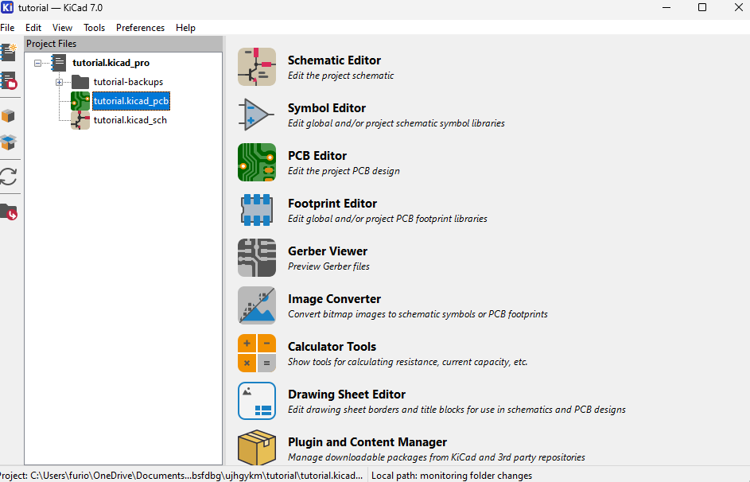

On the right we have a layer view. 

Just to the left of the layer view we have a tool selection tool. 

### Let's start

Select edge cuts

Select a drawing tool (Rectangle is best for this)

Plop a rectangle that is at least 5cm x 3cm.

Didn't quite get the distance right? 

Click on the ruler and you can measure out how large the sides are. 

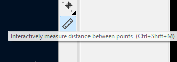

Let's add a footprint for our circuit. 

Click `Add A footprint`

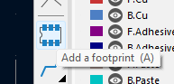

Click somewhere on the desktop. Let's search for Pin Headers. I know that ours need to be 2.4mm so let's start by typing that up. 

Do the same with a resistor. I know mine is: 

* THT - through hole 
* L6.3mm - overall length is 6.3mm
* P7.62mm - distance between the two pins is 7.62mm
* D2.5mm - diameter

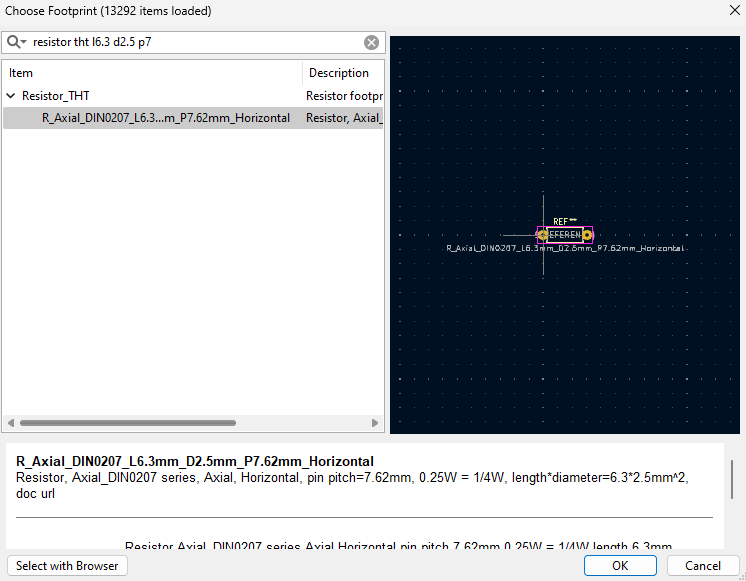

Let's grab an LED. We are using 5mm LEDs 2 pins. 

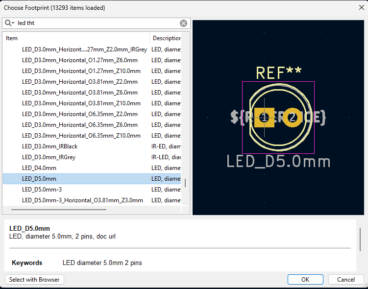

Let's grab a momentary button. 

But which one? I measured one up and it's 6mm. But there are a lot of 6mm momentary buttons. 

Let's click the first one. Oh look documentation! 

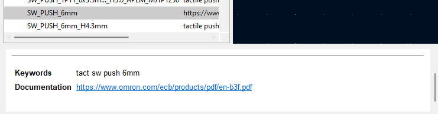

Tactile switch ... looks good. 

I'm going to scroll down the page. The ones we could be using could be either 4.3mm or 5mm. I'm going to pretend that we are using the 4.3mm

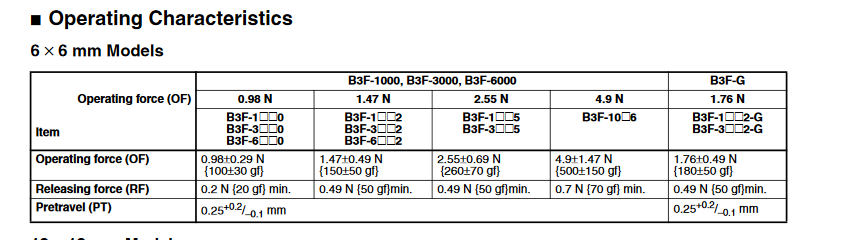

Oh, I changed my mind. A battery was a poor decision for what we are doing later. Let's change to screw pins. Go back to the schematic and change it. 

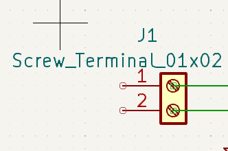

### Specifying which schematic piece our footprint belongs to. 

Select a component (I choose the screw header) and then press `e`

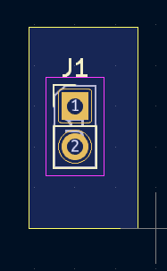

In the reference designator type the reference on the schematic. 

Do that for all of your components. 

When you are doing, go back to your schematic view. 

Go to `tools` and then `update PCB from Schematic`

Stuff happens ... I'll fix this at some stage. 

If everything works, you'll get a link between each component so you can follow the lines for the wire. 

When you want to draw, select F.Cu

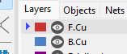

Trace your connections

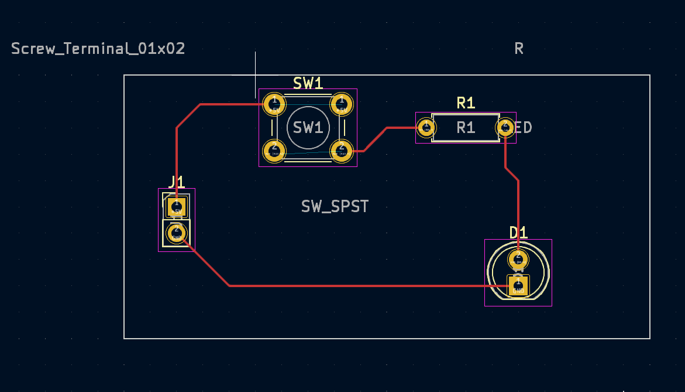

Let's title our board. Go to Front Silkscreen

Click on your desktop and type some dank memes. 

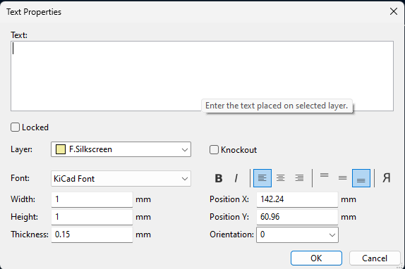

Press alt+3 :)

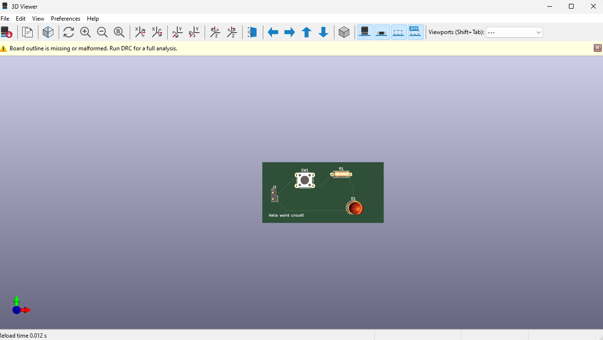

Hey, we got an error, go back to PCB mode and click 

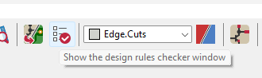

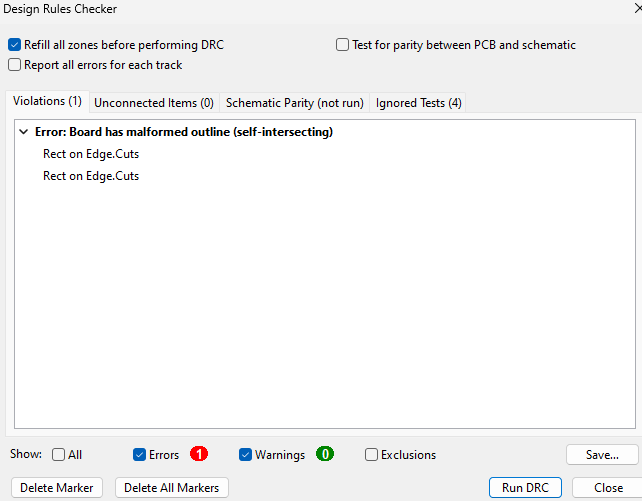
