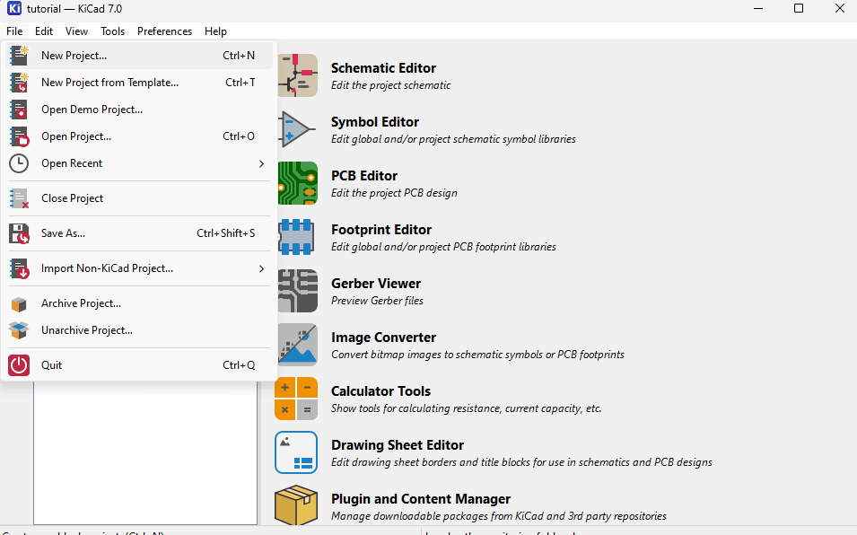
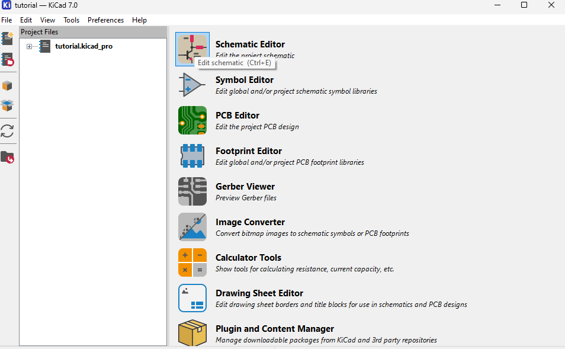
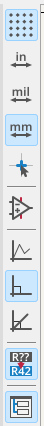
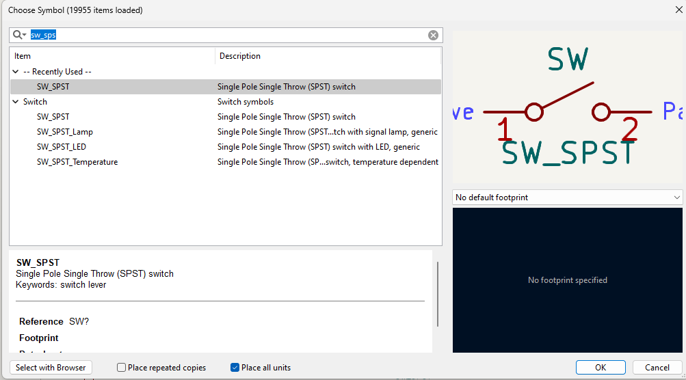
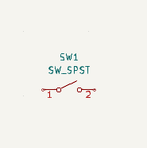
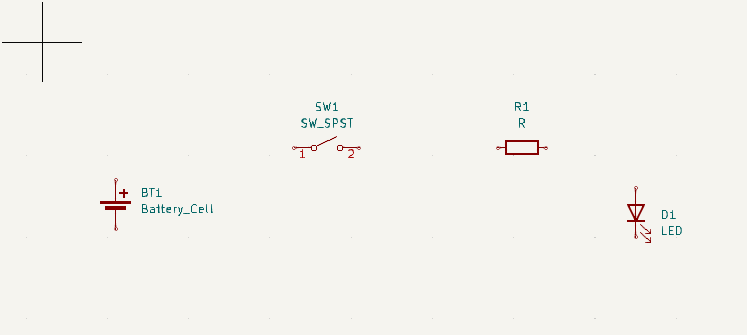
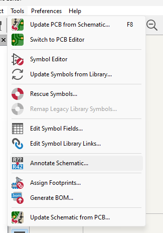
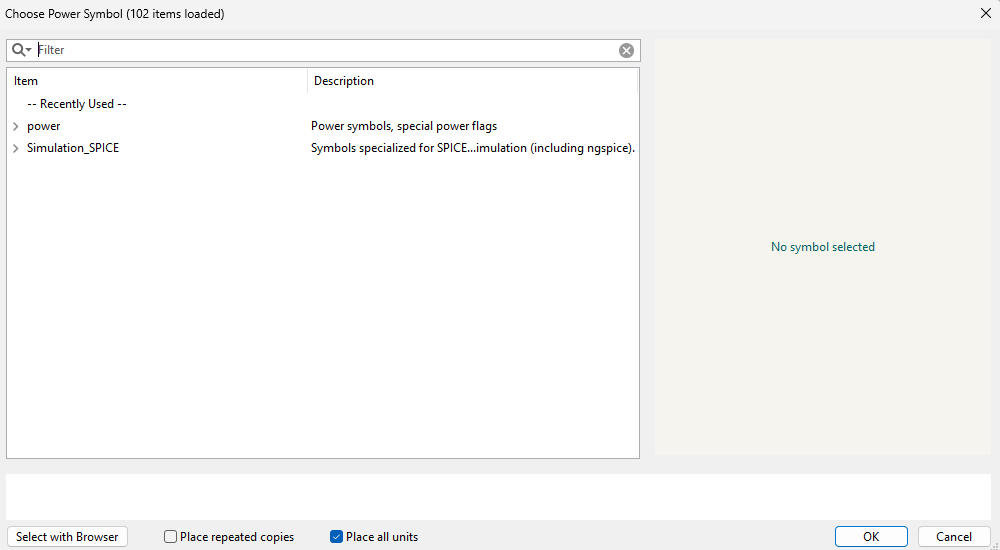
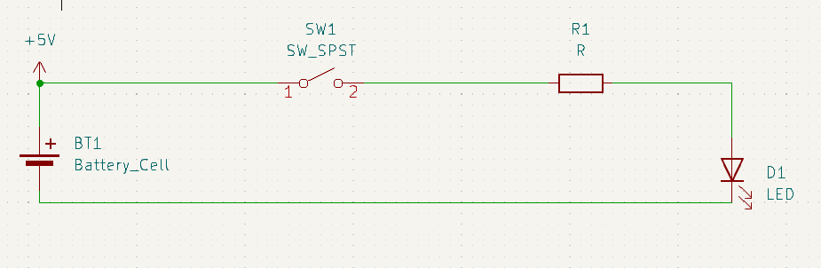
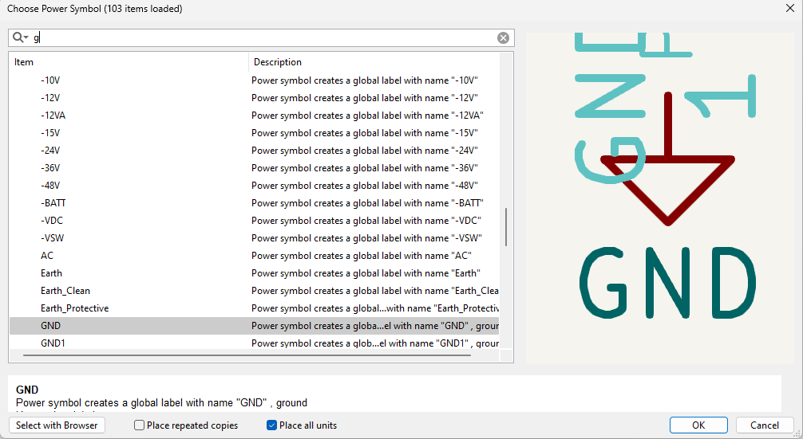

# Design a basic schematic

## Simple Schematics

Open KiCad. It's either pinned to your dash or you need to press `alt` and start typing `kicad`

Make a new project: 

Press `file` then `new project` then give it a name

Go back to load menu and press `schematic editor`

Welcome to the schematic editor

The top row has a list of menu items.

Directly below that is a shortcut to common tools. 

The left of the desktop are page settings. 

On the right of the desktop are schematic tools. 

To the far left we have a layered look at what is on our schematics. 

The desktop is where we do most of our work. 

To start click `Add A symbol`

You'll have to make your own library. After that, search for `SW_SPST` - Single Pole Single Throw Switch. It doesn't matter that we are going to use momentary buttons because we can define that in our footprint. 

Drop it on the board somehwere. 

Do the same for `LED` `R`esistors and `Battery`

To wire the different connectors, hover over an end point and press `w` 

## Desinators

Consider the following labels: 

* BT1 (or BT?)
* SW1 (or SW?)
* R1 (or R?)
* D1 (or D?)

These represent unique values that specify specific components on the board

KiCAD 7 (normally) annotates the schematic automatically. If yours has lots of ? next to BT you'll need to annotate

Let's define our power supply. 

Click on the power symbol

Click somewhere on the desktop 

Search for +5v

Drop it on the desktop on the `+` side of the power. 

Let's do the same for ground. 

