# Onshape

## Learning goals

* How to make an onshape account
* How to navigate a 3D environment
* Explaining sketch-based modelling
* introducing the four foundational features (extrude, revolve, sweep, and loft)
* Transitioning from 2D to 3D
* Introducing basic sketching

## Models

* [Extrude](https://cad.onshape.com/documents/689bd1ec4092abd5315e06ad/w/a95f0bfc2975d7d723a69a0f/e/535831626036603182d2c058)
* [Revolve](https://cad.onshape.com/documents/45e05d897456179e1ae611f0/w/02fe7957b56f4ab77f495018/e/51f0bf1e5cfe75470f6abf81)
* [Sweep](https://cad.onshape.com/documents/36c33a24e279c0d3c8fbc88c/w/156a11bdef0126163b3e3ff7/e/dded7eee387941b1b4308b79)
* [Loft](https://cad.onshape.com/documents/98d1f38ed7ea1c45b5ec524b/w/362445553ab8739068d24527/e/da0972cde16eb8715d62beab)
* [Casting Fixture Demo](https://cad.onshape.com/documents/f46e89c78a72e5ded8d80226/w/c1c002288c2d877886a7257e/e/1059fcc8ac191eb94fd953c6)

## OnShape

### What is onshape?

Onshape is a cloud-based CAD (Computer-Aided Design) platform that enables real-time collaboration, parametric modeling, and version control for designing 3D objects. It allows multiple users to work on a project simultaneously, offering tools for sketching, modeling, and assembling components, all accessible from a web browser.

Onshape is a parametric CAD tool. Parametric CAD is a type of computer-aided design where the geometry of objects is defined by parameters and constraints. These parameters (such as dimensions, shapes, and relationships) control the design and can be easily modified, allowing designers to quickly update and iterate their models while maintaining design intent and consistency.

### Creating an account

1. Open a browser window, and go to www.onshape.com/signup for the Free Plan,
or go to www.onshape.com/edu/signup to sign up for the free Education Plan
(recommended for all teachers and students).
2. Alternatively, go to www.onshape.com and click the [Create Account] button at
the top of the page.
3. Answer a few questions and click [Create Free Account].
4. Check your email for a confirmation email and follow the link within.
5. You’re in!

### Signing in

1. Navigate to http://cad.onshape.com.
2. Enter the email address you used during the sign-up process.
3. Enter your Onshape password.
4. Click [Sign in].
And that’s it! You’re now on the Documents page.

### The documents page

● The Documents page is the first page displayed after signing in. While on any other page,
click the Onshape logo in the top left to return here.
● If you are interested, feel free to take the self-paced course. 

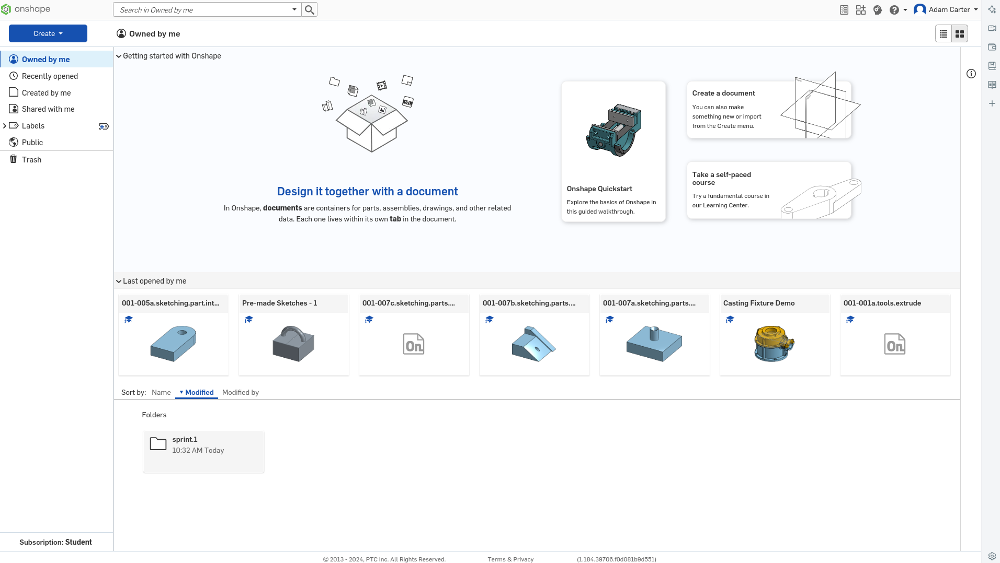

## Learning to think in 3D

Let's get right into it and look at an existing model in Onshape

I've shared with you [Casting Fixture Demo](https://cad.onshape.com/documents/f46e89c78a72e5ded8d80226/w/c1c002288c2d877886a7257e/e/1059fcc8ac191eb94fd953c6)

Load it up

There are 5 main areas of interest:

1. The Feature List: Features are used to create CAD geometry and
this list shows the order in which they were created. (Scroll down in
the left panel to see them all.)
2. The Part List: This is where parts are listed, in chronological order,
as they are created.
3. Tabs: Documents can have multiple tabs such as Part Studios,
Assemblies, Drawings, and more. More on this later.
4. The Graphics Area: Where we view, create, and modify geometry.
5. The View Cube: This helps us rotate and view our model.

Now play around by clicking on the edges and corners of the View Cube. Click on the corner in between the “Front”, “Top”, and “Right” faces, and we will be brought back to the default orientation.

Besides rotating, you can also view your model by zooming in and out, and panning (which translates the model side-to-side without rotating).

1. Try rotating the model by holding down the right mouse button and dragging. Notice
that the orientation of the View Cube always matches the orientation of the model, as
shown below:

2. Now trying zooming in and out by scrolling down and up, respectively. Keep an eye
on where the mouse cursor is, as the zoom is always centered on that cursor. If the
cursor is over your model, you zoom into the model. If the cursor is over to the side, then
you’ll zoom in to blank space. You can also flip the direction of your scroll in your
account preferences.
3. And now, try panning by doing the same gesture as rotating, but while holding down the CTRL key

## Sketched-based modeling and the four foundation features

We’ve learned how to view models, but how do you make them? This 3D object was actually
made by many 2D sketches and 3D features. The concept of making a 3D model out of a
combination of 2D sketches and 3D features is called Sketch-Based Modeling and is common to many professional CAD systems.

### Extrude

Open the [extrude](https://cad.onshape.com/documents/689bd1ec4092abd5315e06ad/w/a95f0bfc2975d7d723a69a0f/e/535831626036603182d2c058) model which has been shared with you. You will need to make a private copy. 

We now have new features at the top of the screen to edit projects. We are going to start with the features at the top left: 

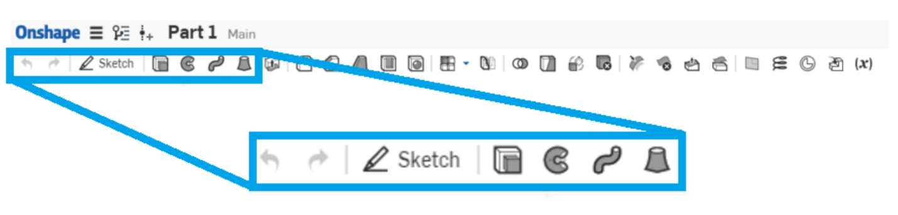

* extrude
* revolve
* sweep
* loft

These are known as the four foundational features. They are important 3D features that modify a 2D sketch into 3D models. These tools are extremely useful in sketched-based modeling as it allows you to create almost any geometry using these four features. 

You should be abe to see a big circle in the middle of your screen. 

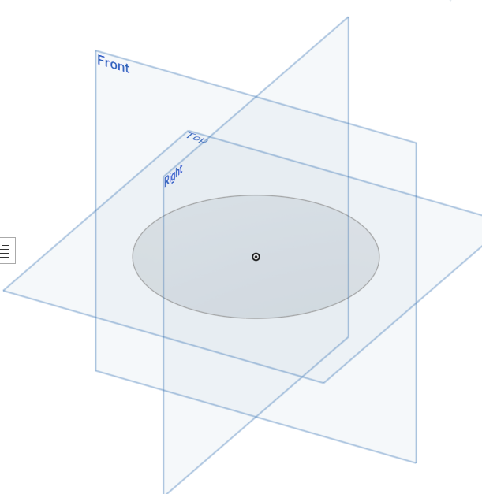

Click on it so it turns yellow

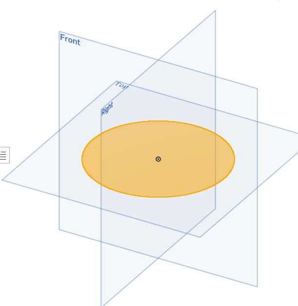

Select the extrude icon

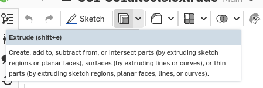

We can already see it has drawn the model: 

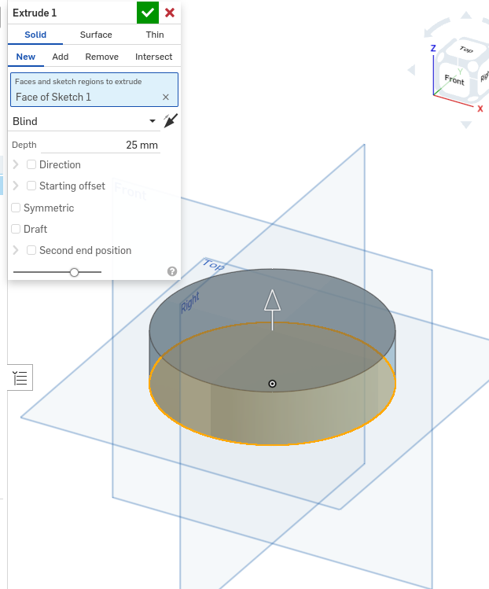

Some things we can do already. 

* Press the arrow button (next to blind) to reverse the direction of the extrude
* change it from 25mm to 50 mm

### Revolve

Let's revolve a sketch. Open up the revolve model from above and you'll see a sketch like this: 

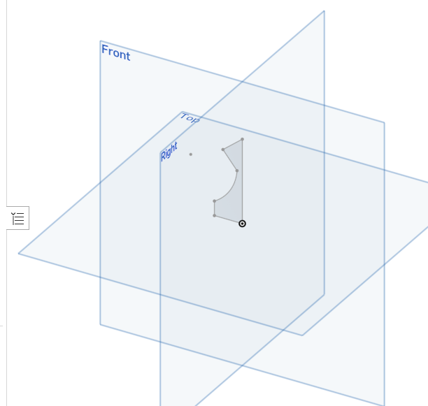

Think about how a 2D sketch can become a 3D model. Imagine you cut this sheet out of paper. Now imagine that the piece of paper is taped to the side of a stick which will will call the axis of revolution. 

What would we see if you spin the stick really fast? You might see a 3D object. In this case, like a dodgy chess piece. The idea of spinning a 2D sketch with a constant cross section around an axis of revolution is called revolving. 

Click on the axis you want to revolve around: 

The face of sketch is the shaded part of the image

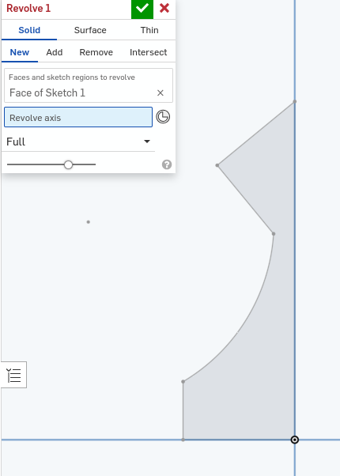

The revolve axis is the long edge in the centre. 

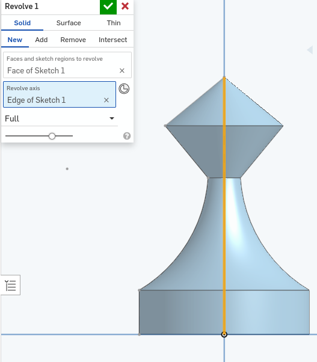

### Sweep

Open up the sweep model shared above. 

Think about what would happen if you drag a circle over a line and extrude a model as you go? The idea of dragging a 2D sketch with a constant cross section along another 2D path is called sweeping. 

Click on the sweep tool and a dialog will show up

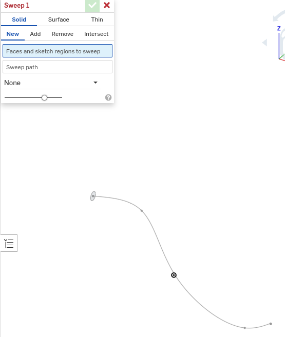

The faces and sketch regions to sweep is the little circle on the left. 

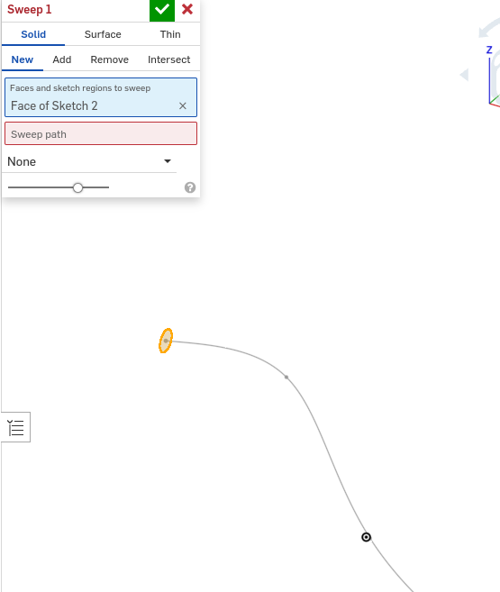

The sweep path is the edge of the s curve

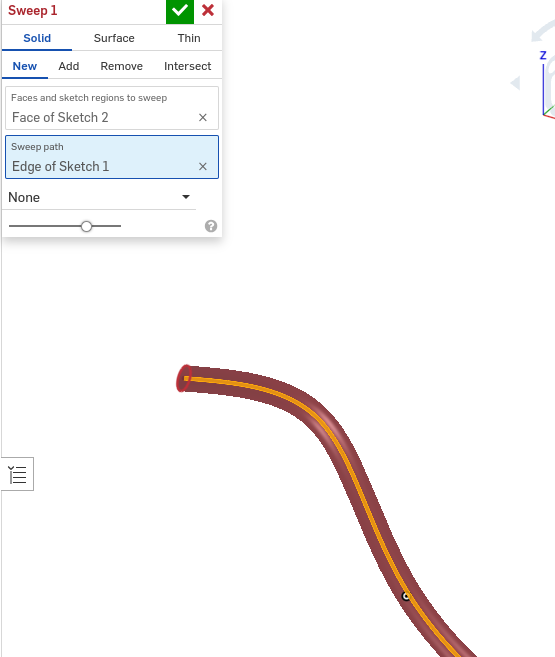

### Loft

Open the loft model above. Notice how we have a new plane (Plane 1). Imagine t hat we could slowly transform that shape to the circle while moving the model up the Z axis. That is called lofting. 

Click on the loft tool: 

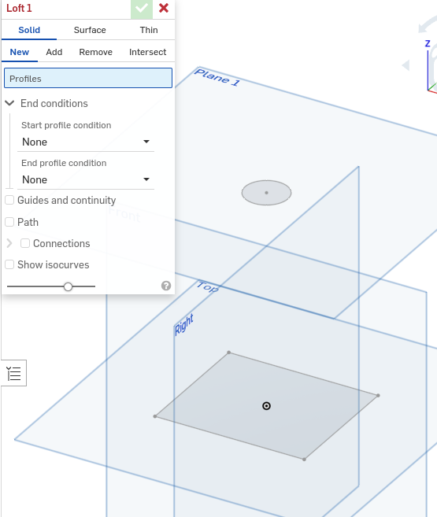

Now click on the base and then the top. 

# Sketching

Make a new drawing

* click on the sketch button
* Click on the `top plane`
* Create a rectangle. Don't worry about the size
  * Choose corner rectangle
  * click on your sketch plane and then move your mouse
  * Make it a rectangle
  * click again to close the rectangle. 
  * 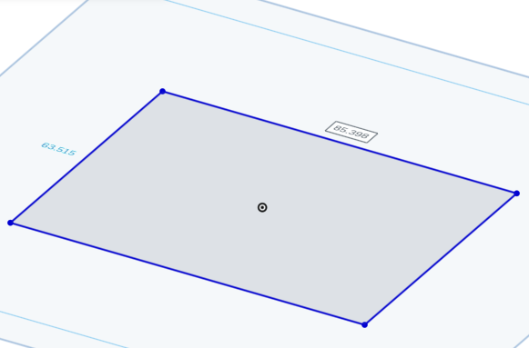
* Click on the 3 point arc tool
  * Click on one corner of your rectangle
  * Click on the next corner of your rectangle
  * Click somewhere on the sketch that makes sense )radius of your arc)
  * 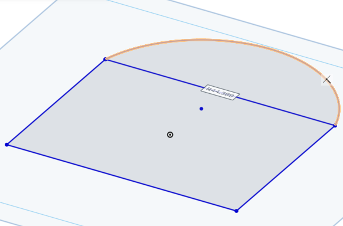
* Create a centre point circle
  * hover over the edge that makes up your semi-circle and your rectangle until you can see the little square appear (the centre of the line)
  * 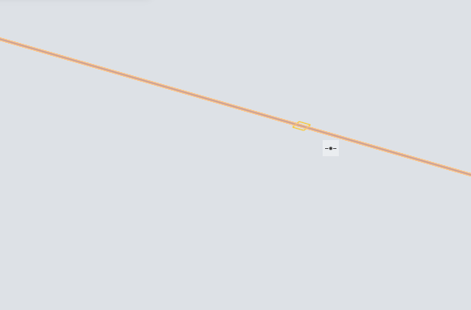
  * Draw a new circle
* Click the tick
* Click on the extrude tool
  * click on both the faces of the rectangle and the arc but leave the inner circle out
  * 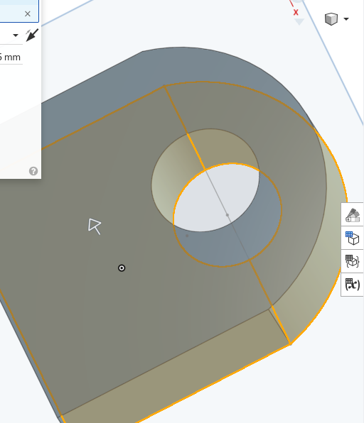
  

Let's try and make the following sketch together

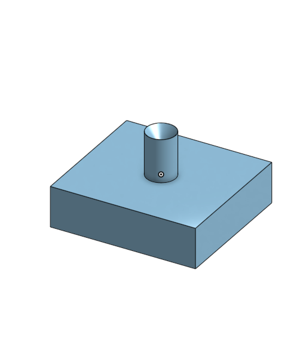

Let's try and make the following sketch together 

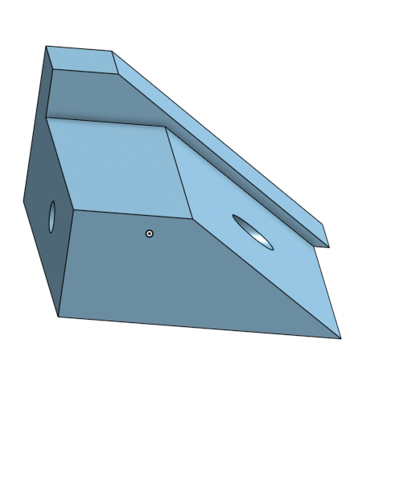

## Challenges 

Make the following models and sketches

* 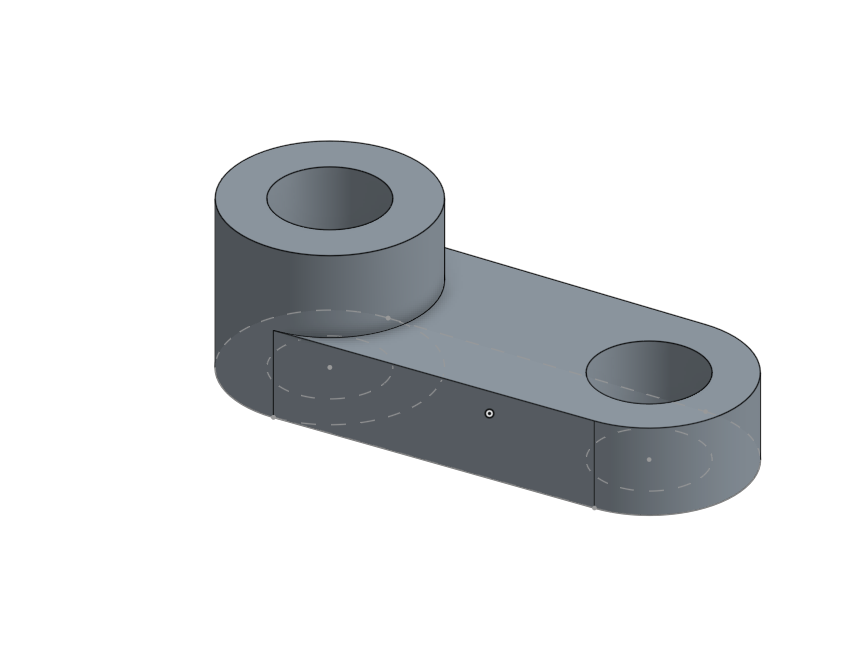
* 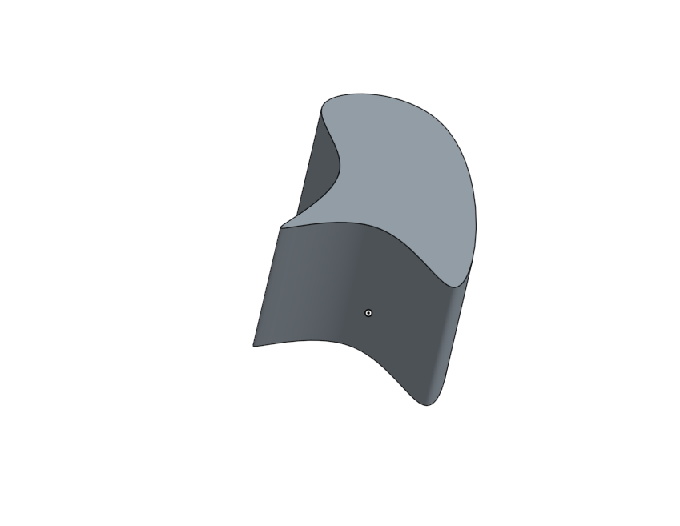
* 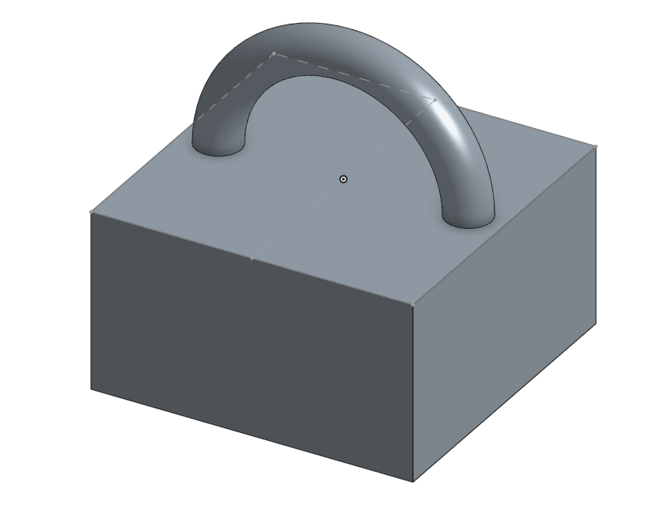
* Create your own model that involves all of the four foundation tools (extrude, revolve, sweep, and loft)
