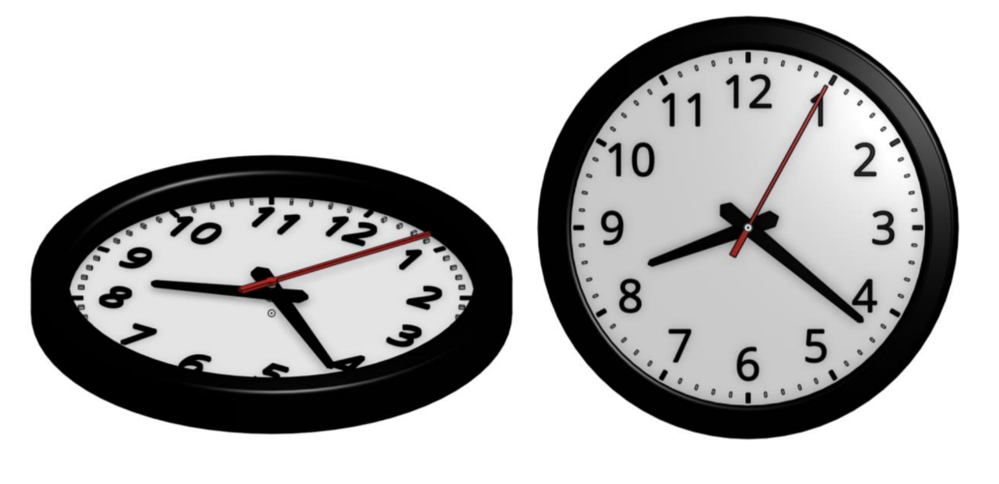
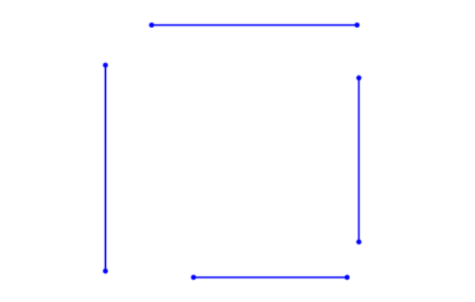
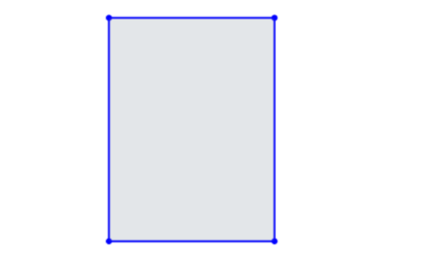
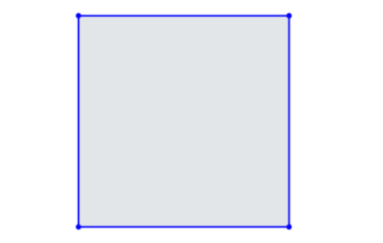
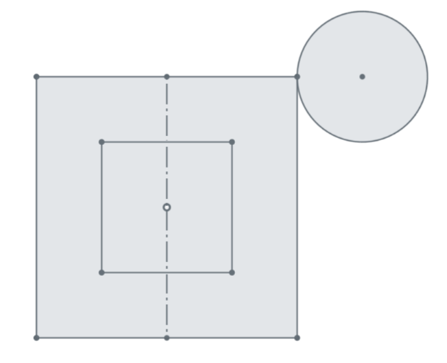
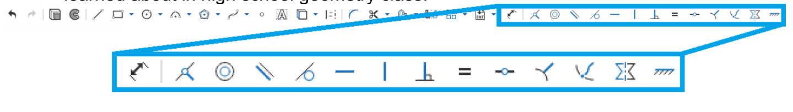

# Introduction to 3D modeling - parts 

## Concepts

* Design intention
* Dimensions and constraints
* Inferencing
* Making accurate parts
* Sketching practice
* Fillets and Chamfers
* Sketch regions
* Parts

Last week, we learned about the Onshape interface, sketch-based modeling, and the four
foundational features. We made a bunch of sketches and parts but didn’t worry about how big
they were or how the sketch entities related to one another. This is a great way to dip your feet
into the ocean that is 3D CAD... but engineers like to be precise. This week, we will learn
primarily about “design intent”, an important concept that allows designers and engineers to not
only accurately create the parts they need, but also design their CAD models so that it is easy to
make changes down the road.

## Design Intention

In this section, we are going to build on what we’ve already learned about creating geometry in
Onshape, and we are going to continue to use our 2D sketch>3D feature workflow. We are
going to learn about “design intent” by way of using Sketch Constraints and Dimensions.
Finally, we are also going to start building more complex parts, by utilizing sketches with
multiple Enclosed Regions.

Most objects around us have parts and features with specific dimensions that relate in some
way to one another. The designer purposefully made these decisions and relationships in order
to execute their design the way they want it to. Design Intent is the practice of developing your
project’s objectives and requirements even before working on your design. The more complex
the geometry, the more we need to think about how we want to design the parts before just
going ahead and making it.

What is the design intention? We could say that the clock as the following design requirements: 

* The hands should always be located in the centre of the clock. 
* The numbers must be equidistant from the centre of the centre of the clock face, so if I move a number closer to the centre they should all move closer
* The numbers should all be the same height

These kind of statements help define what the clock should look like. But how do we satisfy these design requirements in CAD? 

## Dimension tools

Design intent goes hand-in-hand with Dimensions and Constraints. Dimensions refer to the
distance and angle values of sketch entities. Constraints refer to the geometric relationships and
rules within a sketch.

Think back to maths-- remember the words: *tangent, parallel, normal*? These concepts are directly 
practical here in CAD. Even a simple example like a square has many constraints. What are some design requirements for a square? 

There should be four lines: two lines should be vertical and two should be horizontal

The end of each line should be coincident to another end point. 

All lines should be equal length

What would happen if you wanted to draw something a little more complicated like this? 

Try drawing that shape in in onshape. 

You will need to use the dimension tool and the constraint tools. 

Lesson taught in class. 

Continue with video presented in class

## Challenge questions (on google classrooms)

* Complete each challenge question
* Remember to estimate the time to complete and record the actual time it took to finalise
* Record your velocity (estimate/actual)