# Multi-part studios 

## Learning Goals

● Using Boolean operations
● Applying linear and circular patterning
● An introduction to concurrent top-down and bottom-up designs
● Creating a Multi-Part design in a Part Studio

## Boolean Operations

Boolean Operations are a fundamental part of CAD, and in fact, you may remember that they
are actually a mathematical function from way back in algebra class! There are four types of
Boolean operations in Onshape: New, Union, Subtract, and Intersect. New is used to create
new parts, and the other three are used to operate on existing parts. Below is a graphical
representation of how they work. More information on Booleans can be [found in the help](https://cad.onshape.com/help/Content/booleanparts.htm),
and remember, Booleans only work when parts interfere with each other (or are just
touching).

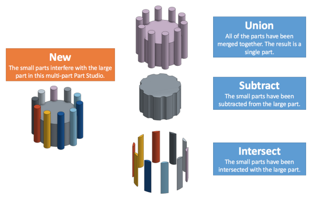

To use the Boolean Operations, click the Boolean Tool  . A dialog box will show up and you
can choose among three operations: 

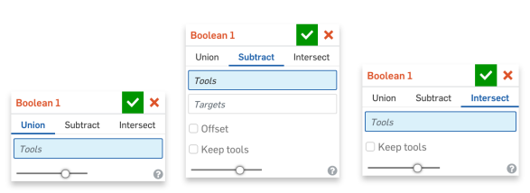

Notice that there are Union, Subtract, and Intersect tabs on the top. Each Boolean Operation
has a “Tools” field, but only Subtract has a “Targets” field since Subtract removes a tool part
from a target. So in the Subtract example above, the tool parts were the small cylinders, while
the target was the the large cylinder.

Also notice the “Keep tools” option. If the “Keep tools” option was selected in the example above,
the tools in the Subtract example (i.e. small cylinders) would appear, as well as the tools in the
Intersect example (i.e. both the big and small cylinders).

### In-Class Exercise

Open up the public document called “College - Boolean Operations” and make a private copy.
Perform the three Boolean Operations (Union, Subtract, Intersect) on the parts in the
corresponding Part Studios to create the three models in the first example. 

## Patterning

Much like mirroring (which we learned in week 2), patterning is a way to automatically build
identical geometry in CAD. In addition, in Onshape it can be “bundled” with boolean operations
such as subtract and intersect, and the result is a versatile and powerful tool.
In a Part Studio in Onshape, both 2D and 3D geometry can be patterned, and the patterns can
be either be linear or circular. Here are the links to the [linear sketch pattern](https://cad.onshape.com/help/Content/sketch-tools-sketch-pattern.htm), https://cad.onshape.com/help/Content/sketch-tools-circularsketch-pattern.htm, [linear pattern](https://cad.onshape.com/help/Content/linearpattern.htm), and [circular pattern sections](https://cad.onshape.com/help/Content/circularpattern.htm) in the Onshape Help. 

### Linear Part Pattern

Let’s use a Linear Feature Pattern to create the following assembly fixture. Instead of
individually making nine of the same 3D features, we can actually just create one, and pattern
that across and down the block three times each:

Open the public document [“Patterning”](https://cad.onshape.com/documents/f138db752e8443ff478a6354/w/194fae0c1dc3e5a0be1b4833/e/2d499168718105ef5aedaa15?renderMode=0&uiState=66b06ecf2df1833a233bdf7c) and make a private copy of it.
It should look like this

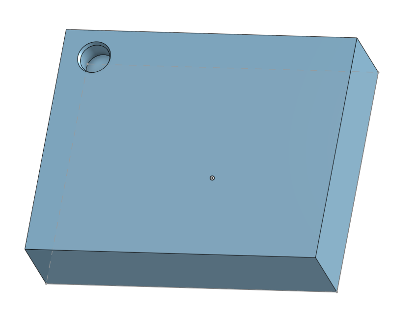

Add a chamfer that is 0.6 mm wide and 1.2 mm deep using the `Two Distances` Chamfer type. 

We’ll pattern the pocket in two directions: First, let’s pattern it across, by referencing the
top edge of the part (highlighted in orange). We’ll pattern 3 instances with a 1.5” pitch.
Make sure that “Pocket Extrude,” “Pocket Corner Fillet,” “Pocket Base Fillet,” and the
chamfer you created in the previous step are selected. Also make sure that the arrows
are pointed in the right direction (boxed in blue below).

Now, in the same feature toggle the “second direction” toggle. This will allow us to
reference the left edge of our part, and pattern 3 more instances at a 1.25” pitch:

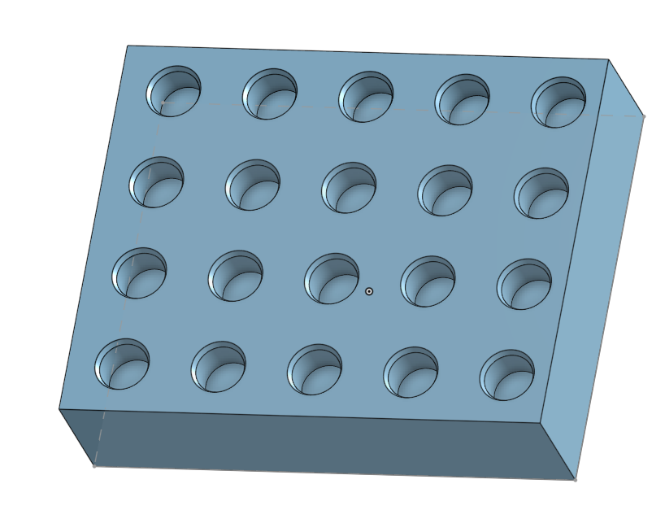

#### In-Class Exercise: Top-Down Linear Part Patterning

For this exercise we are going to create the same Assembly Fixture, but from a “TopDown” approach. Go to Part Studio 2. It should look like this: 

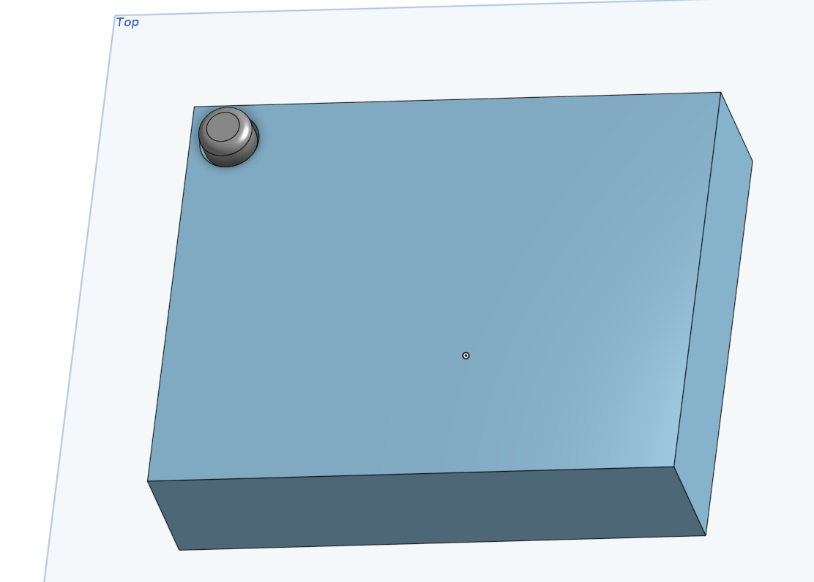

If you hide Part 1, you can see that Part 2 is filleted on the bottom:

Now, pattern the part like you did in the previous example and boolean subtract the part
from the fixture to create the pocket.

Can you figure out how to include the boolean subtract with the linear pattern?

Right now the pocket is the exact same size as the part that it goes in it. How could we
easily add a .2mm gap around the part in the pocket to account for manufacturing
tolerances?

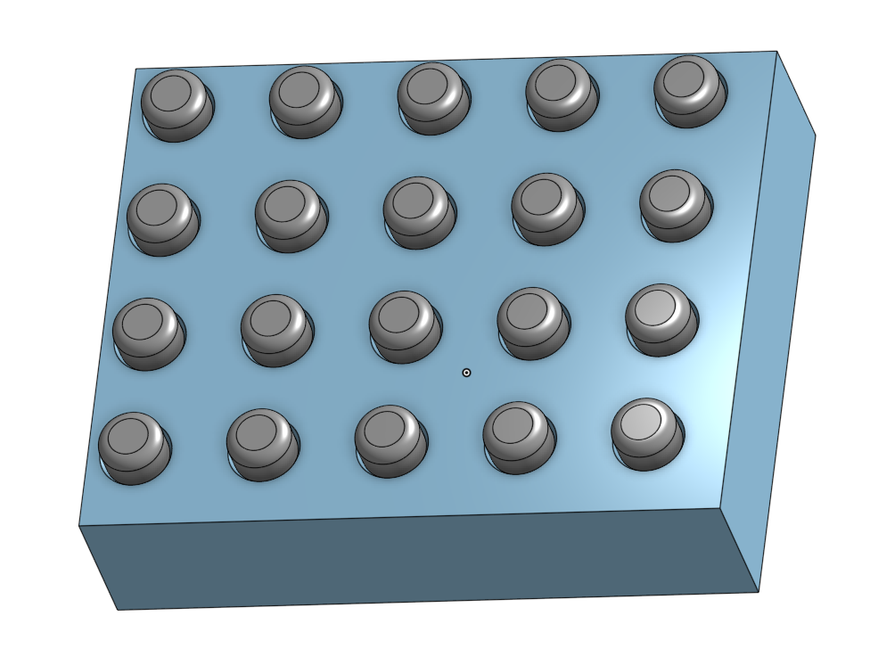

### Circular Part Pattern

This is probably the more often used pattern tool. If you think about it, there are many circular
patterns that we see on a daily basis such as wheel spokes, fan blades, shower head jets, etc.
For this exercise, we will create this flanged nozzle:

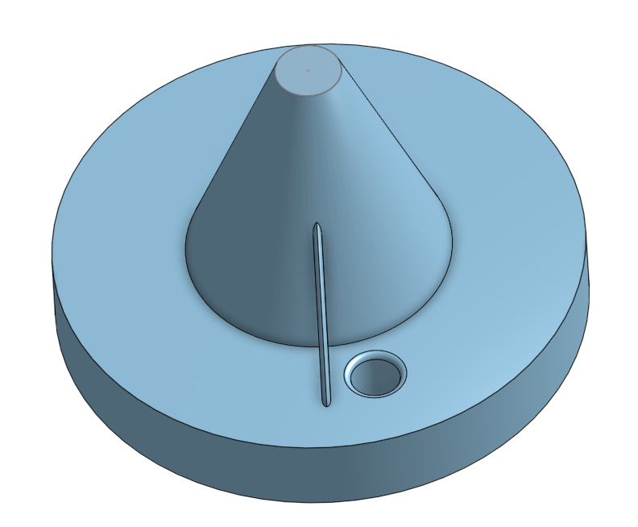

Open to the Circular pattern part. 

We’re going to create a circular pattern of this hole (and chamfer) around the centreline
of our revolve feature. Make sure that “Main Body Sketch” is unhidden so you can see
the dotted centreline.

Click on the Circular pattern tool and make sure that ”Feature pattern” is selected
from the dropdown menu. This is because we’re going to pattern an extrusion, not a part.
Select “Hole Extrusion” and “Chamfer 1” for “Features to pattern” and the centreline for
“Axis of pattern”. For this feature, we will create five equally spaced holes:

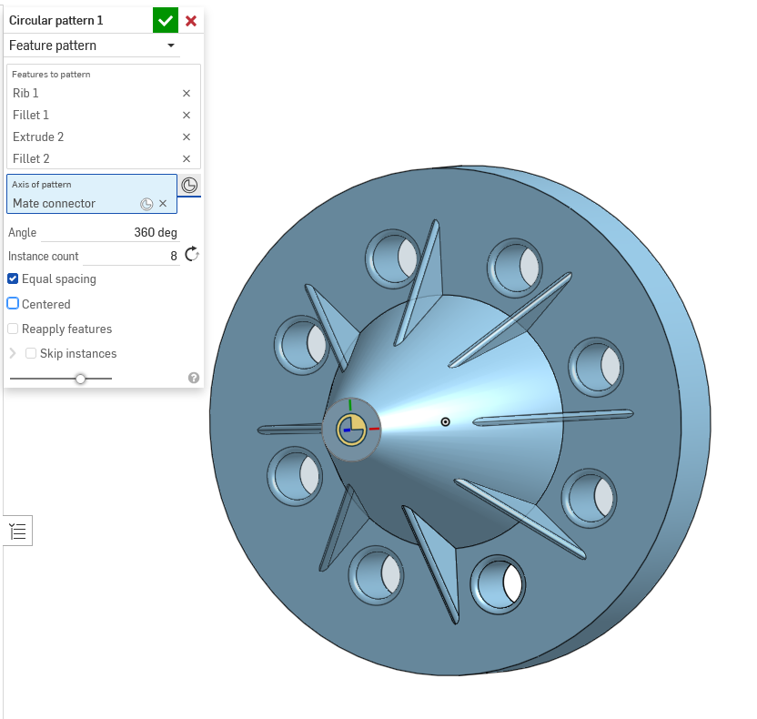

Now, let’s make a circular pattern of the triangular rib. This time, select “Triangular Rib
Extrusion” and “Fillet 1” for “Features to pattern”: 

Pro Tip: You can also make the circular pattern by picking the conical or cylindrical faces of the
model instead of the sketch axis. This can save you a lot of time!

## Sketch Patterning

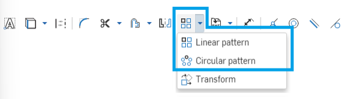

This can be very helpful, when you want to pattern construction geometry, or when the sketch is
complex. It won’t be covered in this curriculum, as the functionality is almost identical to the
feature and face pattern exercises above. For more information on sketch patterns, refer to the
Onshape Help: 

* [Linear Sketch Pattern](https://cad.onshape.com/help/Content/sketch-tools-sketch-pattern.htm)
* [Circular Sketch Pattern](https://cad.onshape.com/help/Content/sketch-tools-circularsketch-pattern.htm)

## Assemblies in Onshape

Now that we’ve learned about different ways to manipulate 2D and 3D geometry, let’s switch
gears and learn about assemblies. An assembly in the real world is something made up of many
parts. For example, you may assemble an IKEA desk, using parts you bought in a kit from IKEA.
Assemblies in CAD are similar, but have a very distinct meaning, even more so in Onshape.
Just like in the real world, CAD Assemblies are where you bring different parts together and
assemble them to make a final product or a subassembly to an even bigger product.
As we’ve seen already, Onshape actually lets you make multiple parts in a single Part Studio,
which sounds an awful lot like an “assembly,” so what’s the difference between an Onshape
Part Studio and an Onshape Assembly and when do you use which?

**Part Studios**: Part Studios are where you create and modify geometry. Unlike other
CAD systems, you may make as many parts in a single Part Studio as you want. This
technique is called Multi-Part Modelling and it’s very powerful because, as we’ve seen,
you can make parts that highly depend on one another.
In Onshape, Multi-Part Modelling allows the designer to create a single sketch which can
create multiple parts (as we’ve already done), and a single feature can affect multiple
parts at the same time. This is different from traditional CAD applications.

**Assemblies**: Assemblies are where you take the parts that you’ve already made and
put them together to make something bigger. You use things called Mates (which we’ll
learn all about in Week 4) to position the parts where you want and to define movement.
In other words, assemblies are where you assemble parts and view how they move.
We’ll talk more about this later, but assemblies are also where you would instance a part
(use the same part multiple times). Lastly, assemblies often experience faster
performance of big, complex assemblies as compared to having a single Part Studio
with the same number of parts.

Now, this may be a lot to take in, but it’s important and exciting! We’re about to go from making
simple little parts to making fully-working multi-part assemblies that move. But, before we do,
there’s one more important concept to cover and it’s the distinction between two different and
common styles of designing:

**Bottom-Up Design** is when a product is designed by creating sketches, then features,
then parts (often one per Part Studio), and then assemblies. In this approach, the
geometry is created starting with the lower level entities (like 2D lines and circles) up the
hierarchy to the highest level assembly (such as the final product being built).

**Top-Down Design** is when the shape of an overall product is sketched first, and then
different regions of that sketch are used to create the lower level parts and their features.
Top-Down is a more intuitive way to approach a design because typically we, as
designers, envision the final product first, then as time goes on, we refine the concept
into finer and finer detail.

### Top-Down Design with Multi-Part Design

Open the Universal Joint Exercise

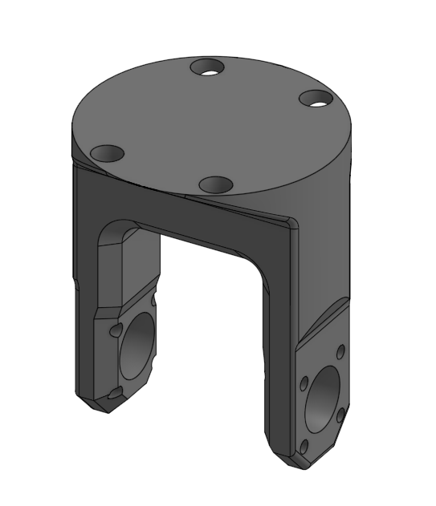

Select the + sign in the bottom left of the document and choose Create Assembly

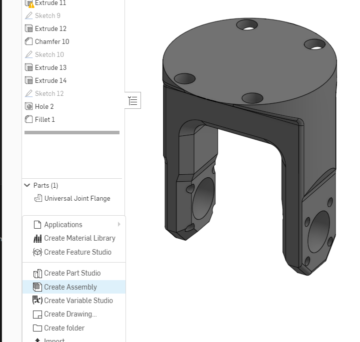

Navigate to the assembly tab. Insert the part into the assembly tab. Choose current document and part studio. Be sure part is the selected filter and click the universal joint flange into the insert dialog. Click into the graphics area to insert the part into the assembly space. Click the tick to accept. 

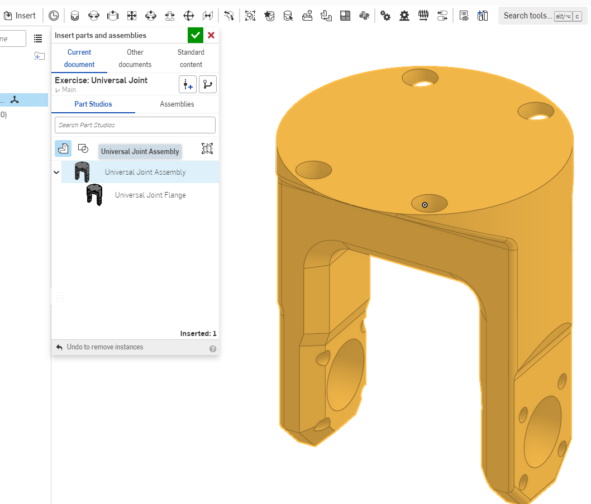

Select the part to display the triad manipulator. Then drag and drop the triad to the shown mate connector point. 

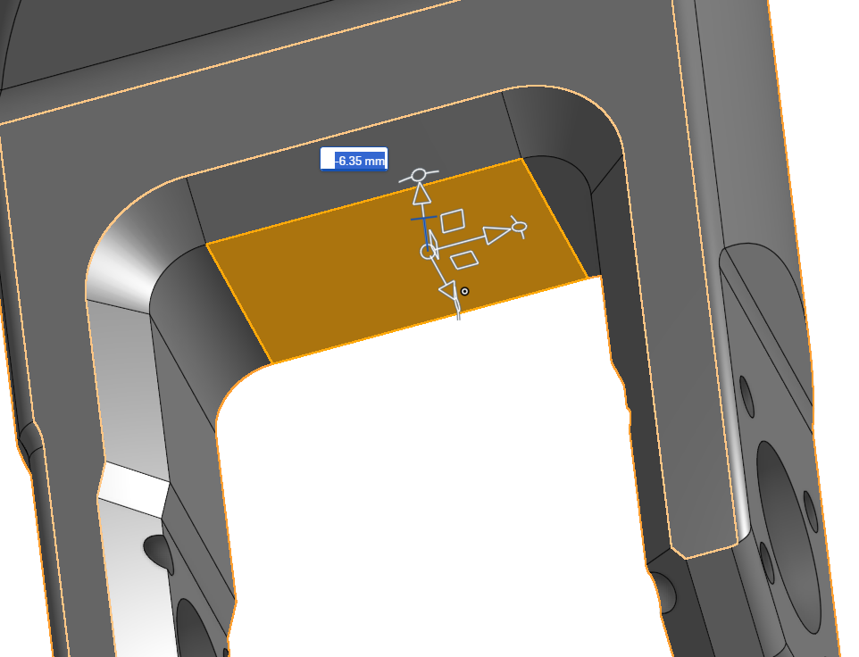

To move the part to the origin right click on the centre circle and choose move to origin. 

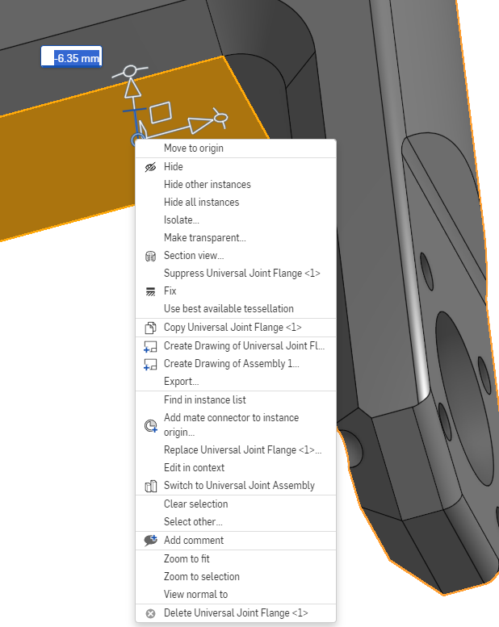

To reorient the part so it is facing upwards. Right click on the arrow of the triad manipular that is normal to the selected face and choose Align with Z. 

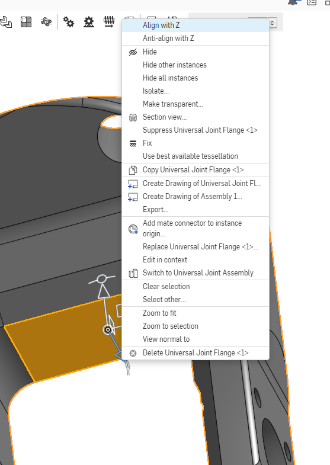

To fix the part in space, right click anywhere on the part to select fix. 

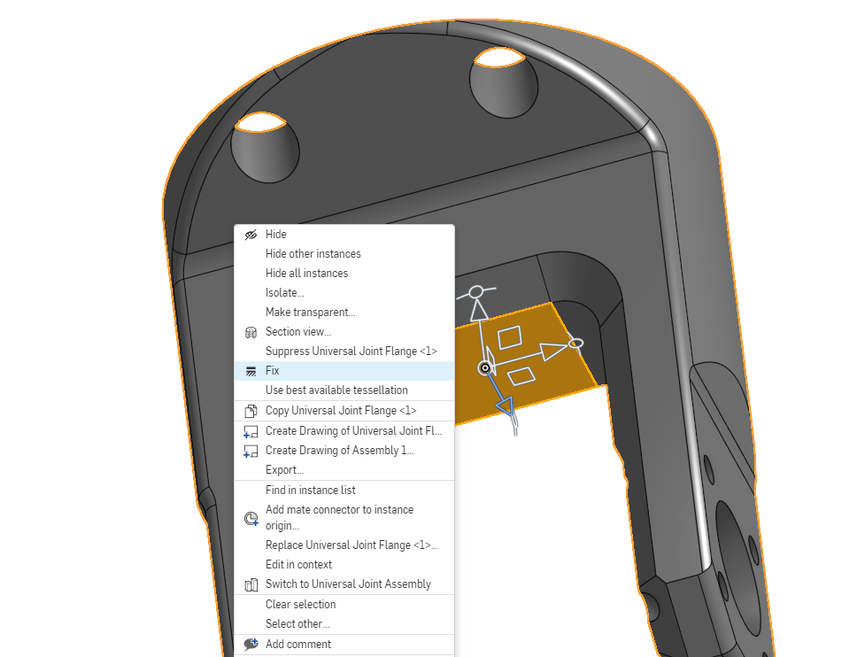

#### Mating Parts 

Make a copy of the Clamp Assembly

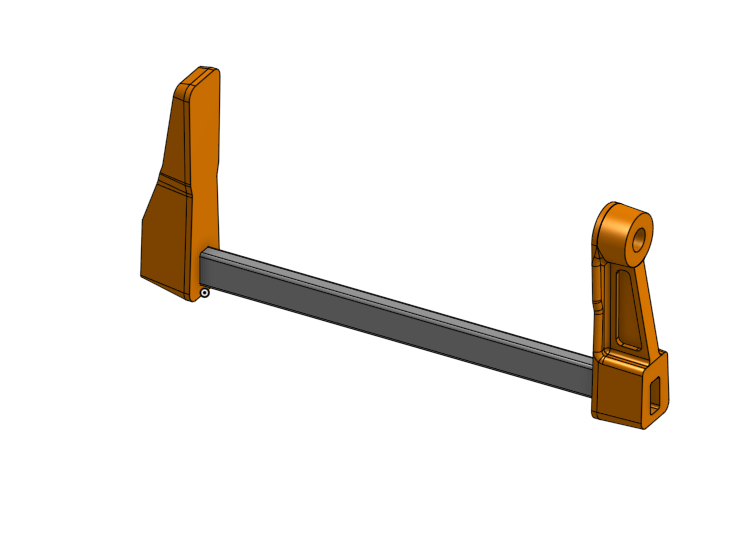

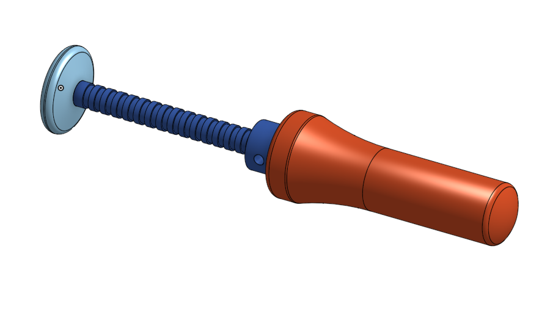

Navigate to the assembly tab and insert the clamp parts 

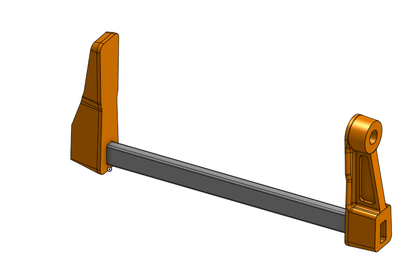

Use the triad manipular to move the rod so that the centre front aligns with the assembly origin and then fix the part when positioned. 

Create a fastened mate between Mate connectors located at the end of the  end face of the road and the centre of the cut in the fixed clamp as shown. Click the tick to accept. 

To allow the sliding clamp to slide along the road create a slider mate between the end of the cut and the clamp. 

The mate connectors should be centred in the cut of the sliding clamp and centred in the rod end face. If needed (it probably will be needed) hold shift to lock the display of the mate connector of the needed face when making the selection. 

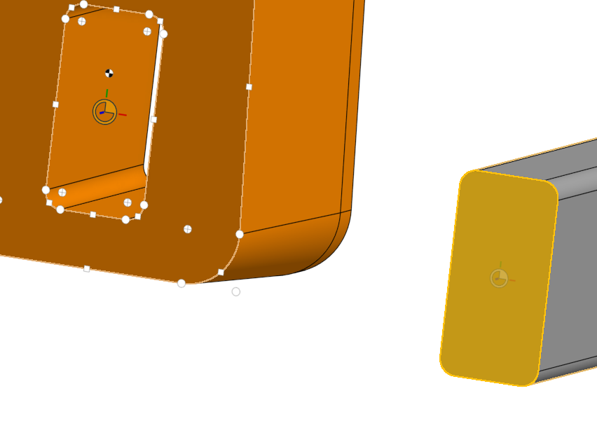

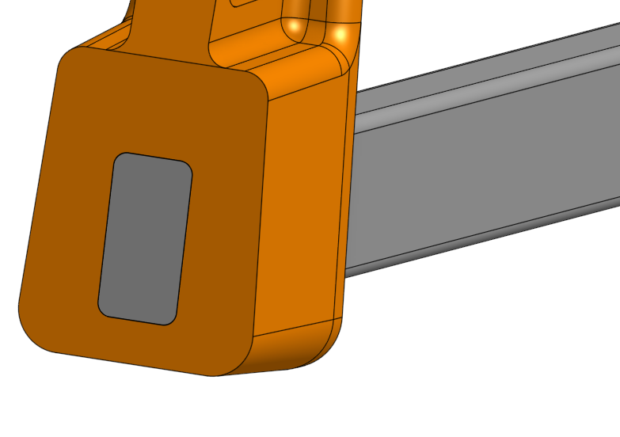

Give it a limit of 10cm

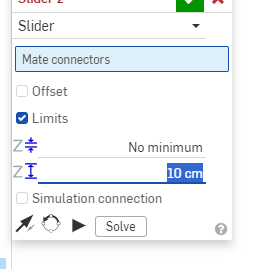

Insert the handle

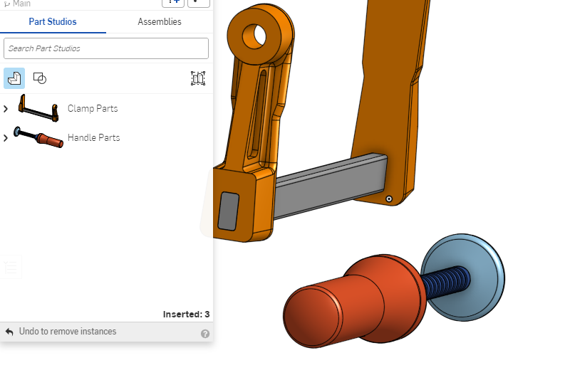

Create a fastened mate between the handle and the shaft using the mate connectors. 

Use the revolute connector to connect the thread shaft. Add a limit so the threaded shaft can only slide 5cm towards the left of the road. Be sure the set hole is towards the front of the assembly. 

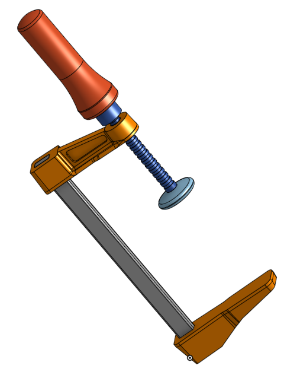

Fingers crossed you can move the instances and see how they move. 
