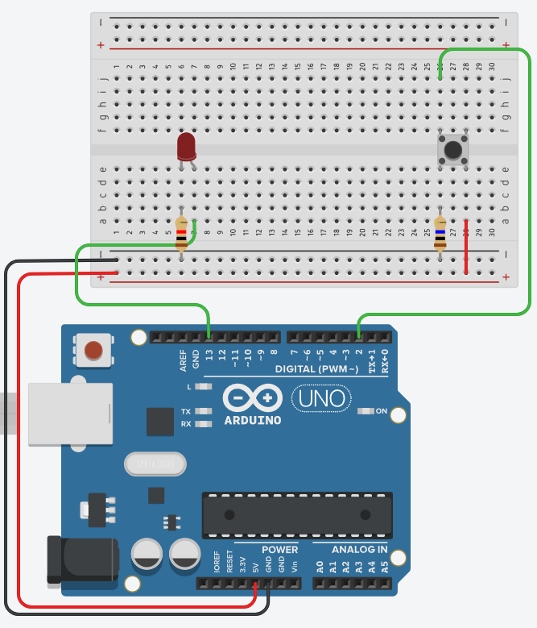

## Challenges 

### Challenge 1

Use your skills at KiCad to design the following circuit. 

You will need to produce: 

* Schematic 
* PCB
* Rendered diagram

### Challenge 2

Let's up the ante

Let's build an interactive circuit

You will need to produce: 

* SChematic
* PCB
* Rendered diagram