# Design a basic schematic

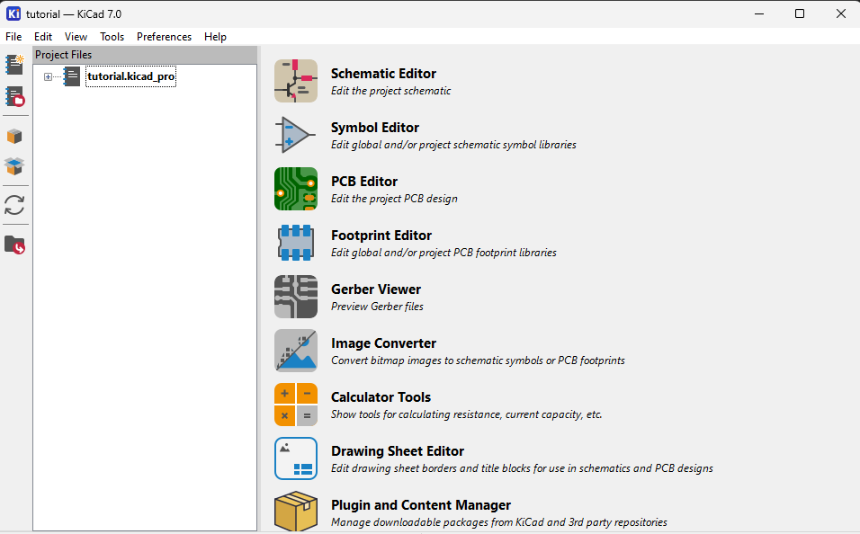

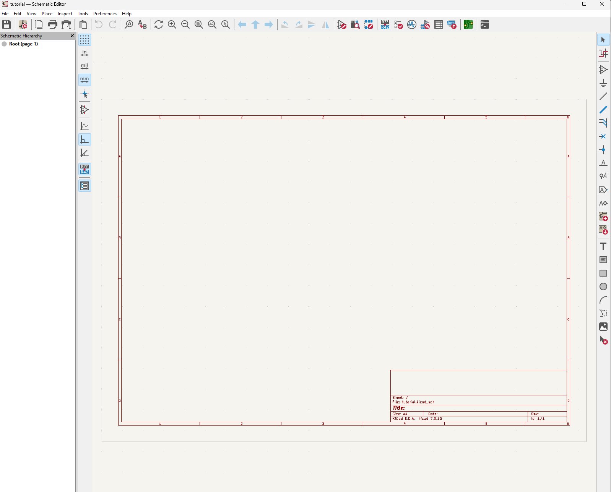

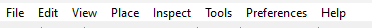

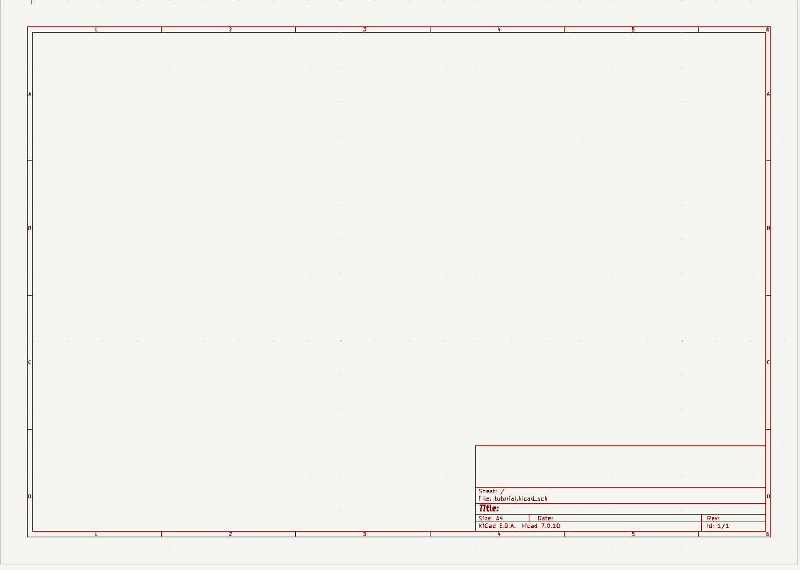

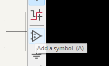

You'll have to make your own library. 

Hover over an end point and press `w` 

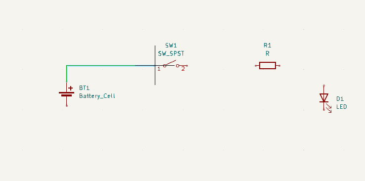

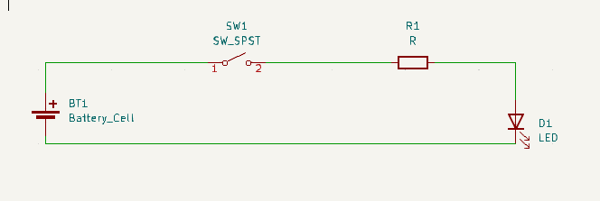

## Desinators

Consider the following labels: 

* BT1 (or BT?)
* SW1 (or SW?)
* R1 (or R?)
* D1 (or D?)

These represent unique values that specify specific components on the board

KiCAD 7 (normally) annotates the schematic automatically. If yours has lots of ? next to BT you'll need to annotate

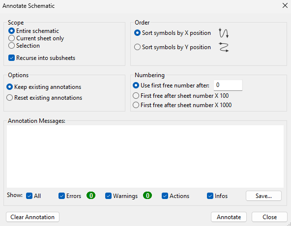

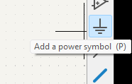

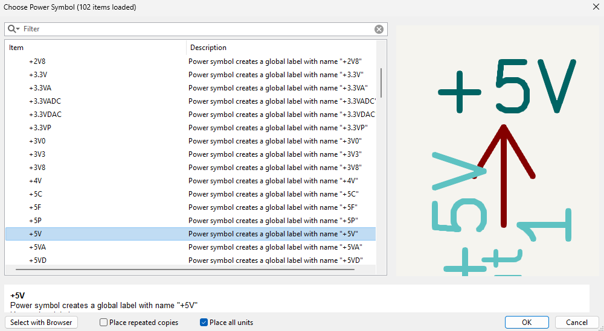

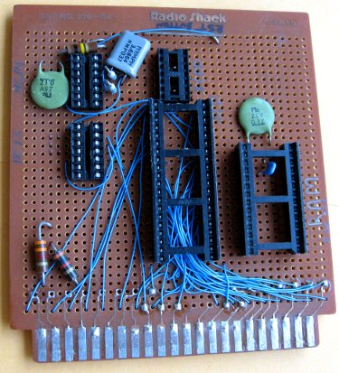

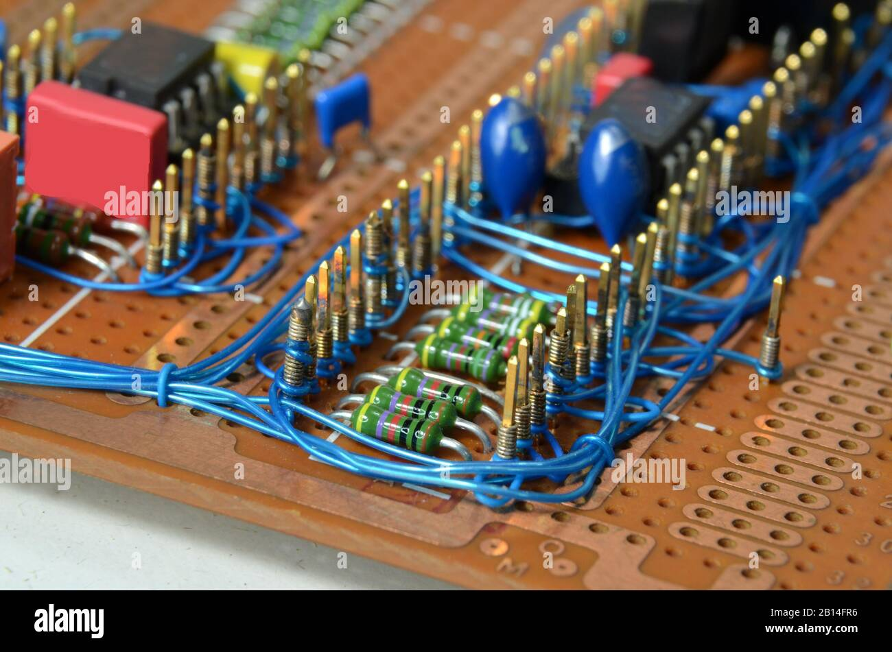

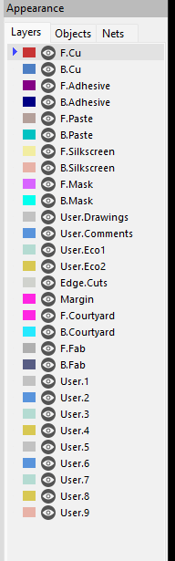

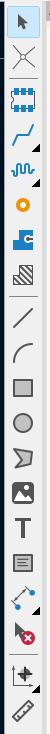

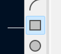

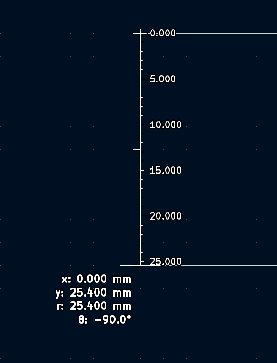

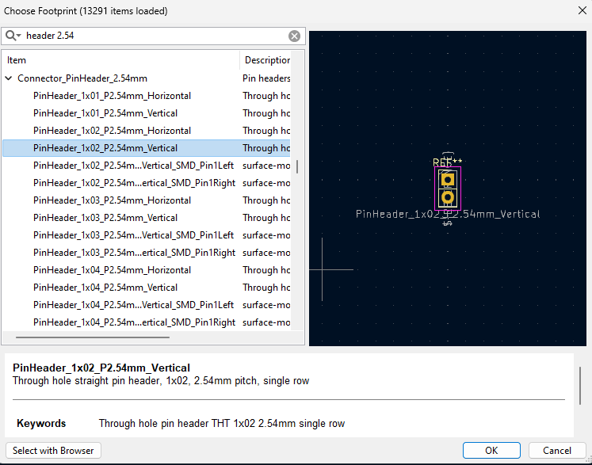

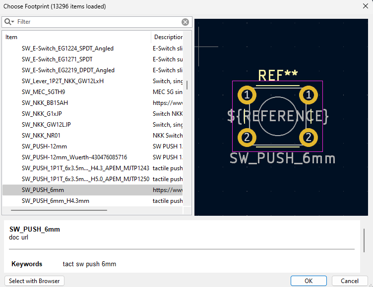

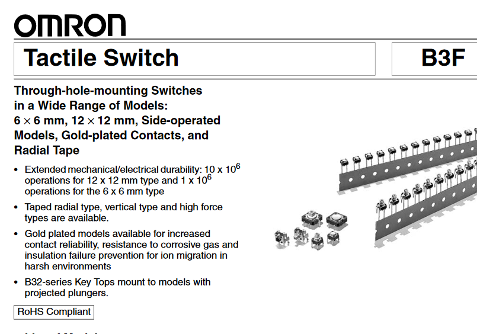

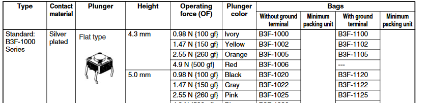

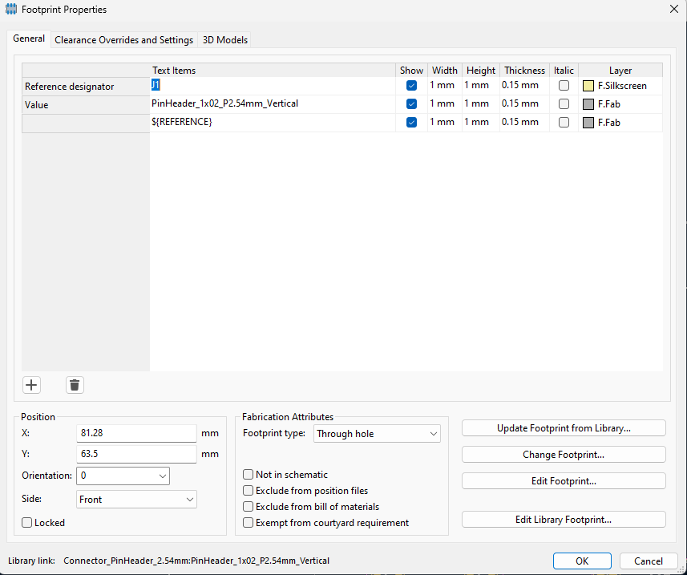

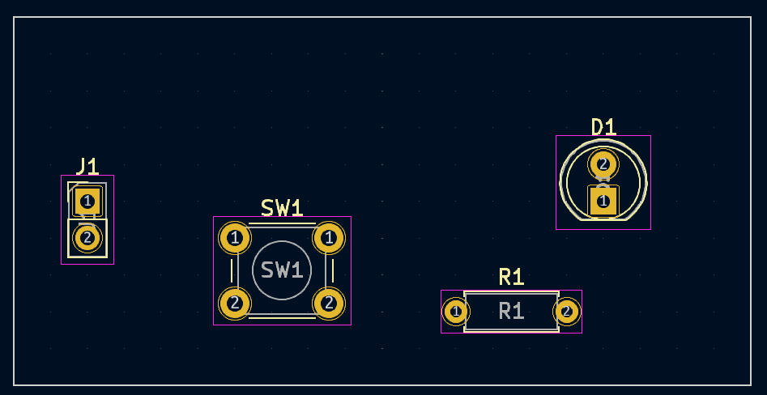

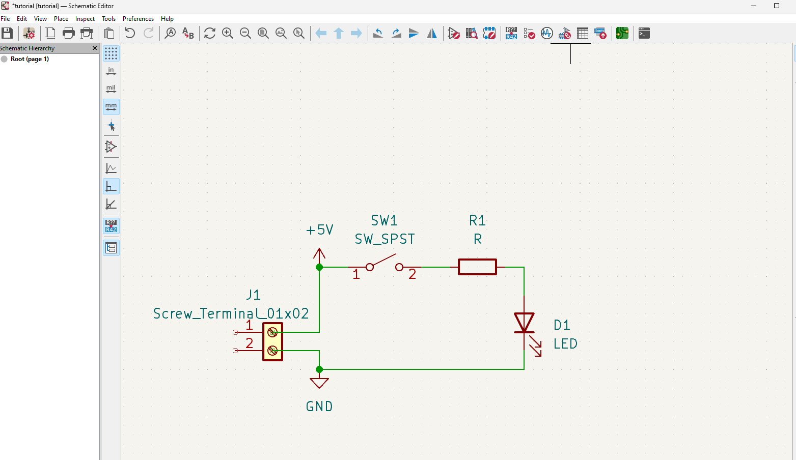

Press alt+3 :)

Hey, we got an error, go back to PCB mode and click 

