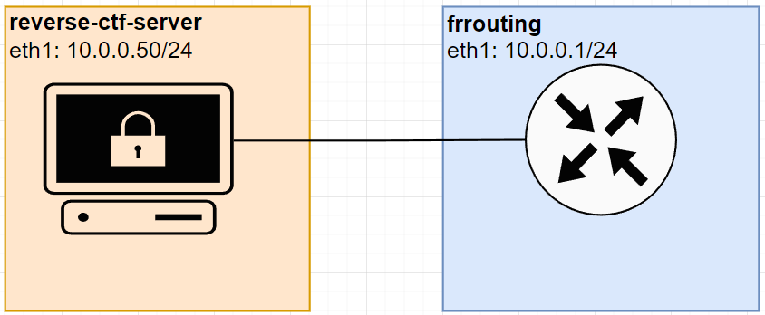

# Set router with single static network





## Create a topology file

```yaml
name: test-router-static
topology:
  nodes:
    r1:
      kind: linux
      image: frrouting/frr:latest
    test:
      kind: linux
      image: reverse-ctf-server
      ports:
        - "2222:22/tcp"
  links: ['r1:eth1', 'test:eth1']
```


## Configuration

### r1: 

```bash
docker exec -it clab-test-router-static-r1 vtysh
```

```shell
configure terminal
interface eth1
ip address 10.0.0.1/24
end
write memory
show interface brief
```

### test

```bash
docker exec -it clab-test-router-statc-test sh
```

```sh
apk update
apk add iproute2

ip addr add 10.0.0.50/24 dev eth1 
ip link set eth1 up

ip route add default via 10.0.0.1
```

```bash
sudo containerlab deploy -t <whatever your topology file is called>.yml
```