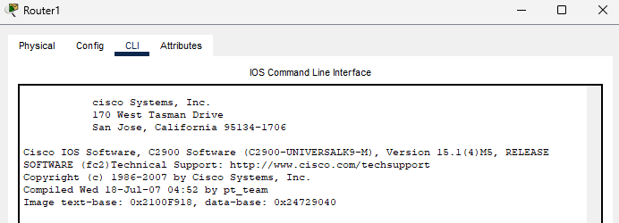
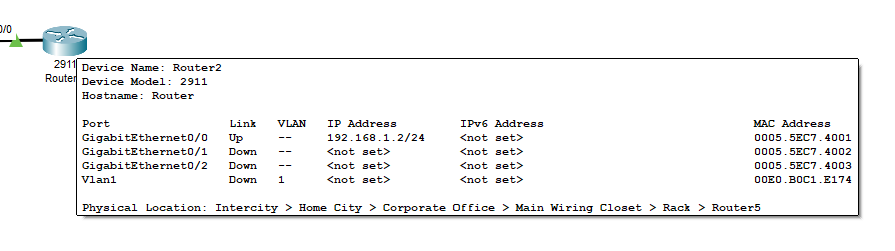

# Router Configuration

Launch and Place a Router


## Start Cisco Packet Tracer.


Choose a Router: From the bottom left devices panel, select 'Routers'. Drag the `2911 router model` onto the workspace.


## Cable Connections


- Click on the lightning bolt icon for connections. Choose the straight through cable.
- Use Gigabyte ports
- Connect Devices: Click on the router, then click on another device (e.g., another router, switch) to automatically choose the appropriate cable and connect them.


By default I use `G 0/0/0`


## Basic Configuration


Access the Router CLI: Click on the router. In the window that opens, navigate to the 'CLI' tab to access the Command Line Interface.



We don't want to enter initial configuration dialog. So type `no` and press `enter`


## Enter Global Configuration Mode

- Type `enable` to enter privileged EXEC mode.

```
Router>enable
Router#
```

## Check our interfaces 

- Type: `show ip interfaces brief`

```
Router#show ip interface brief
Interface              IP-Address      OK? Method Status                Protocol 
GigabitEthernet0/0     unassigned      YES unset  administratively down down 
GigabitEthernet0/1     unassigned      YES unset  administratively down down 
GigabitEthernet0/2     unassigned      YES unset  administratively down down 
Vlan1                  unassigned      YES unset  administratively down down
Router#
```

## Configure Interfaces

- Type `configure terminal` to enter global configuration mode.
- For Ethernet: interface gigabitethernet0/0 (or the appropriate interface number).
- Assign IP: ip address 192.168.1.1 255.255.255.0 (substitute with your desired IP address and subnet mask).
- Enable the interface: no shutdown.
- Repeat for other interfaces as needed.
- Set Hostname (Optional): hostname <YourRouterName> to change the router's name.
- Save Configuration: write memory or copy running-config startup-config to save your configuration.

```
Router#configure terminal
Enter configuration commands, one per line.  End with CNTL/Z.
Router(config)#interface g 0/0
Router(config-if)#ip address 192.168.1.1 255.255.255.0
Router(config-if)#no shutdown

Router(config-if)#
%LINK-5-CHANGED: Interface GigabitEthernet0/0, changed state to up
```




## Test Connectivity

Use Ping: From another device, open the command prompt and use ping 192.168.1.1 (replace with your router’s IP) to test connectivity.

```
Router(config-if)# end
Router# 
Router# ping 192.168.1.2

Type escape sequence to abort.
Sending 5, 100-byte ICMP Echos to 192.168.1.2, timeout is 2 seconds:
.!!!!
Success rate is 80 percent (4/5), round-trip min/avg/max = 0/0/2 ms

Router>
```

