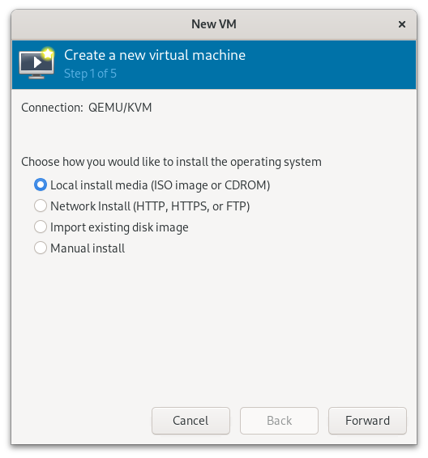
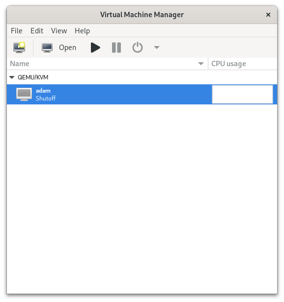
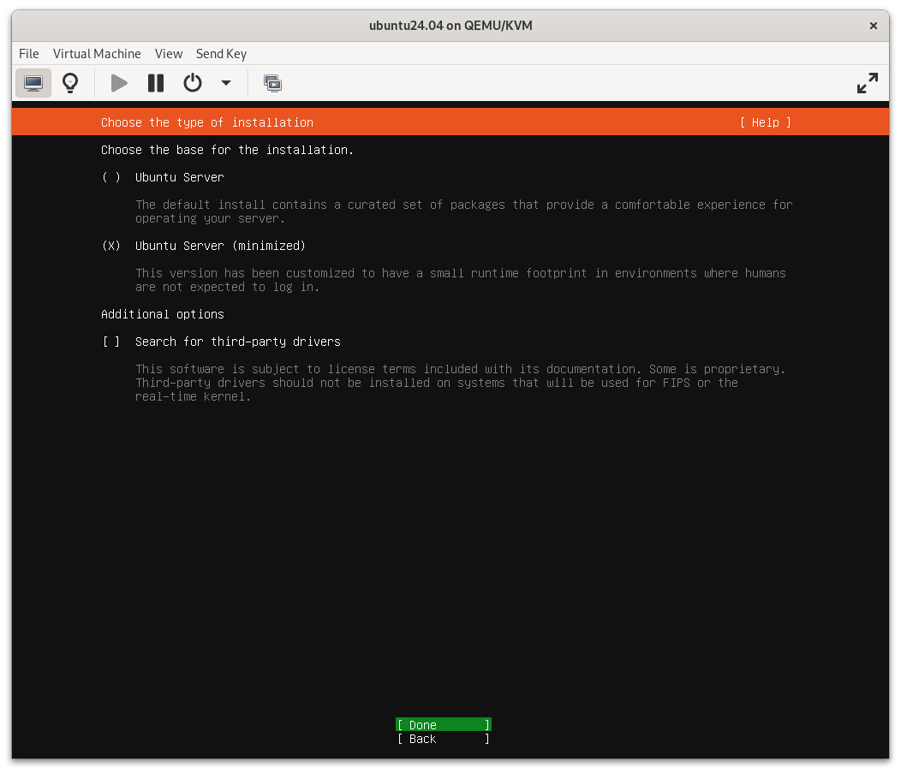

# Installing a Virtual Machine

## Concept 

Learning how to manage your own computer is an important aspect of learning how to deploy and manage systems and networks. 

This lesson will teach you the core skills of installing a virtual machine onto your computer.

## Goals

### At the end of this lesson you will be able to

* Use QEMU/KVM and virtual-manager to install a server oriented distribution of linux to your computers
* Set up your account and password on that system
* Install a SSH server to your computer
* Configure that SSH server to use passwords to log into your machine
* Log into your new machine from your computer


## Glossary 

* QEMU high level hypervisor emulates a computer's processor allowing you to deploy guest (virtual) machines
* KVM is a low level hypervisor that is a virtual virtualization solution for Linux on x86 hardware including Intel and AMD processors. 
* hypervisor performs hardware virtualization such as disk, network, video, usb, ETC. 

## Instructions

```bash
virt-manager
```










