# Lesson 1: Installing a Virtual Machine with Fedora Server 43

## Concept

A **virtual machine (VM)** is a computer running inside your computer. Instead of buying a whole new physical server, you can create one in software. This lets you safely experiment, break things, and learn — without any real consequences.

We'll be using **QEMU/KVM**, which is the gold standard for virtualisation on Linux. Think of it like this:

- **KVM** is the engine — it talks directly to your CPU to make virtualisation fast
- **QEMU** is the body — it pretends to be all the hardware a computer needs (disk, network card, screen)
- **virt-manager** is the dashboard — a graphical app that makes it easy to manage everything


## Glossary

| Term | Meaning |
|------|---------|
| **VM** | Virtual Machine — a computer running inside software |
| **Host** | The lab machine you're sitting at |
| **Guest** | The virtual machine running on the host |
| **ISO** | A disk image file — like a virtual DVD |
| **KVM** | Kernel-based Virtual Machine — Linux's built-in virtualisation engine |
| **QEMU** | Quick Emulator — hardware emulation layer |
| **virt-manager** | A graphical tool to manage VMs |
| **NAT** | Network Address Translation — your VM shares your host's IP address |
| **Bridge** | A direct network connection — your VM gets its own IP address |
| **SSH** | Secure Shell — a way to log into a remote machine securely over the network |
| `sudo` | "Super User Do" — run a command as administrator (used inside your VM) |
| `dnf` | Fedora's package manager (like an app store for the terminal) |
| `nano` | A simple text editor in the terminal |
| `systemctl` | A tool to start, stop, and check the status of system services |

---

> 📋 **Lab machines are pre-configured.**  
> QEMU/KVM, `libvirt`, and `virt-manager` are already installed and running on your lab machine by your instructor. You do not need to install or configure anything on the host — just open `virt-manager` and go. Everything from Part 1 onwards happens inside your VM, where you will have full administrator access.

---


## Installation 

### Downloading Fedora Server 

Go to https://fedoraproject.org/server/download/ and download Fedora Server DVD (iso)

You can either download it in the browser or via the terminal. To do the later, right click the download arrow and use it for your `wget` address.

```bash
cd ~/Downloads
wget https://download.fedoraproject.org/pub/fedora/linux/releases/44/Server/x86_64/iso/Fedora-Server-dvd-x86_64-44-1.7.iso
```

### virt-manager

From terminal you can run:

```bash
adam@51:~$ virt-manager
```

Or press meta (windows) and type `virt`

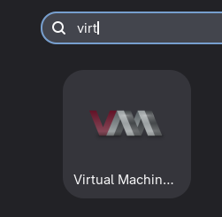

---

Click this guy: 


---

Click forward: 

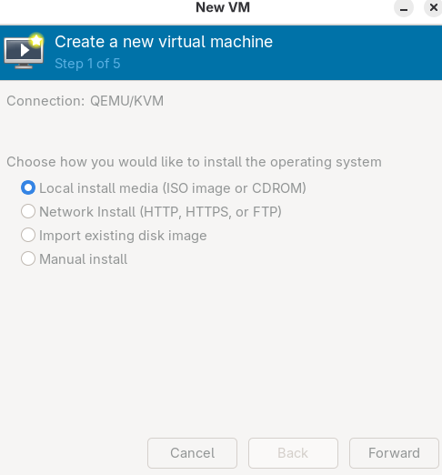

---

Click Browse

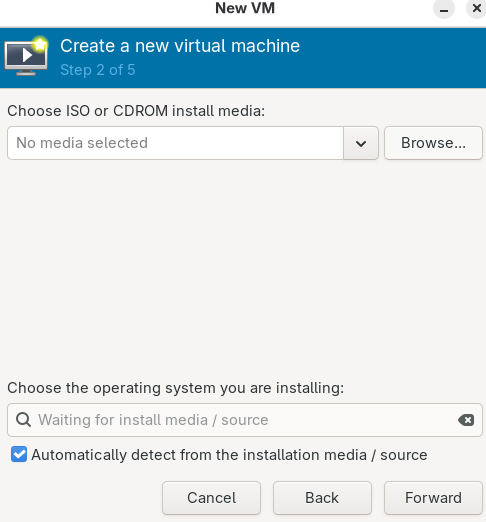

---

Click browse local: 

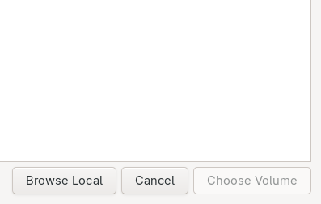

---

Go to wherever you installed it: 

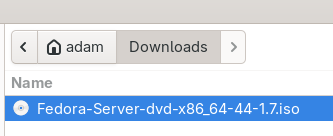

Click open

---

Click forward

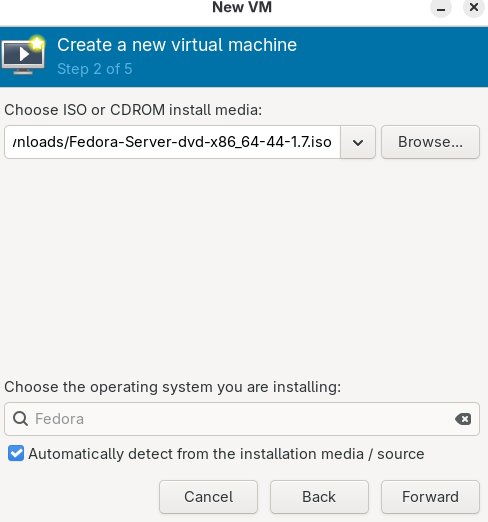

---

Click forward

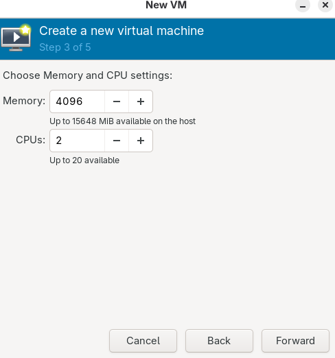

---

Click foward

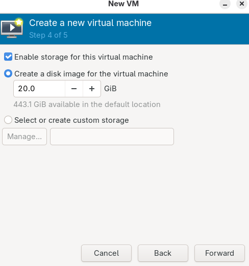


---

Give yourself a name and then press finish

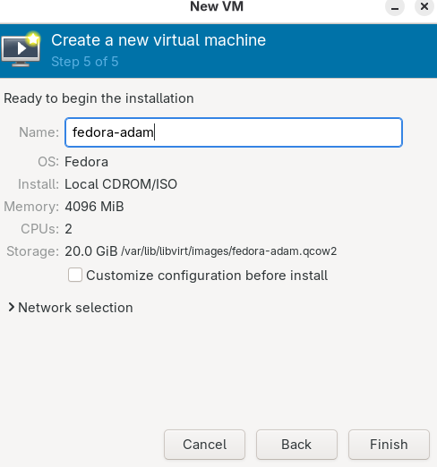

---

You want to install Fedora

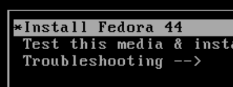

---

Some stuff will happen

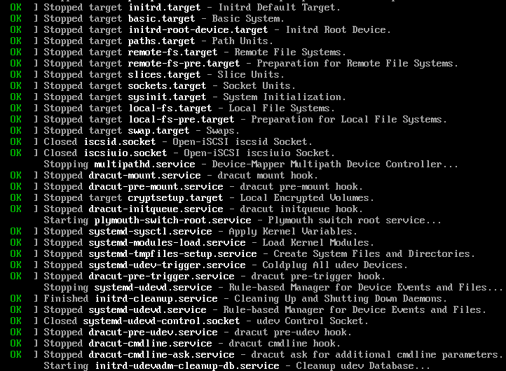

chilax!

---

Make sure it says English (Australia)

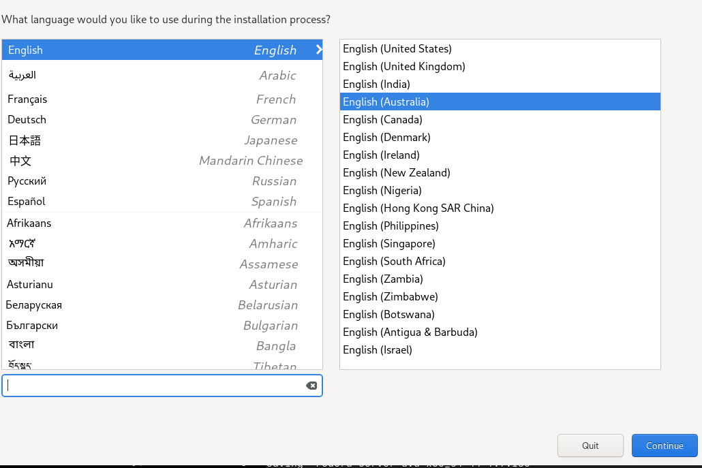

---

Click Install Destination 

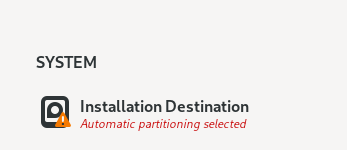

Then click done. We are just keeping the default configuration 

---

Give yourself a username and password

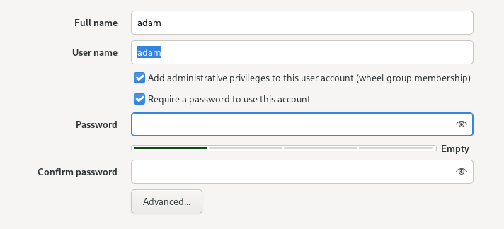

Click done when you are done

NOTE: If you forget your password or your username, you will need to re-install your VM. 

---

Begin installation!

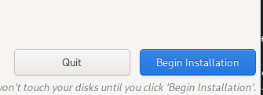

---

Some stuff will happen: 

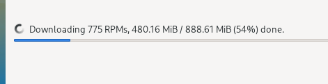

---

Eventually it will ask you to reboot it: 

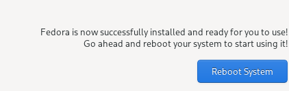

Click it!

---

Click the little lightbulb at the top of your screen: 

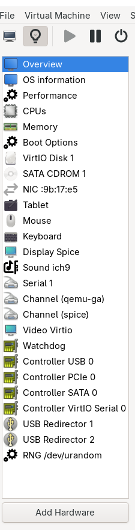

Then click Add Hardware at the bottom

---

Add a Network card and change it from NAT to Bridge and write br0 in the device name 

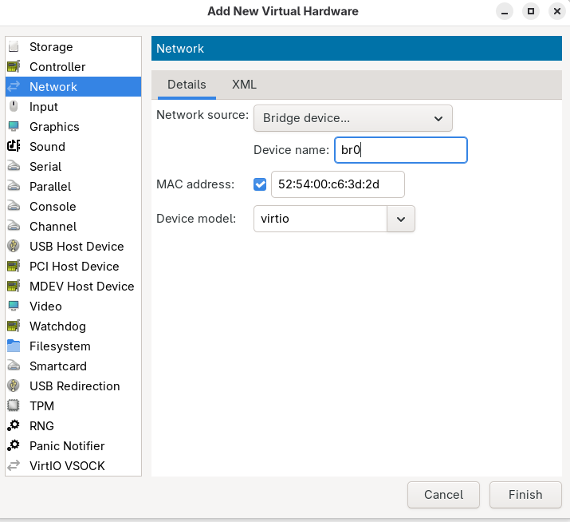

---

Click the little screen to go back to your remote desktop. 

### Remote desktop 

log in with your username and password 

---

Update fedora 

```bash 
sudo dnf update -y
```

---

Install nano (a text editor)

```bash
sudo dnf install nano -y
```

---

Enable password authentication for ssh

```bash 
sudo nano /etc/ssh/sshd_config
```

---

Find your password auth status 

Press control+f and search for `#Pass` and press enter

Press `delete` not backspace 

it should look like this: 

```bash
# To disable tunneled clear text passwords, change to "no" here!
PasswordAuthentication yes
#PermitEmptyPasswords no
```

Press control + s to save and then control + x to exit

---

Restart ssh server. 

```bash
sudo systemctl restart sshd
```

---

Check your ip address 

type `ip a`

```bash
adam@localhost:~$ ip a
1: lo: <LOOPBACK,UP,LOWER_UP> mtu 65536 qdisc noqueue state UNKNOWN group default qlen 1000
    link/loopback 00:00:00:00:00:00 brd 00:00:00:00:00:00
    inet 127.0.0.1/8 scope host lo
       valid_lft forever preferred_lft forever
    inet6 ::1/128 scope host noprefixroute 
       valid_lft forever preferred_lft forever
2: enp1s0: <BROADCAST,MULTICAST,UP,LOWER_UP> mtu 1500 qdisc fq_codel state UP group default qlen 1000
    link/ether 52:54:00:9b:17:e5 brd ff:ff:ff:ff:ff:ff
    altname enx5254009b17e5
    inet 192.168.122.227/24 brd 192.168.122.255 scope global dynamic noprefixroute enp1s0
       valid_lft 3073sec preferred_lft 3073sec
    inet6 fe80::e9b7:ff72:8727:3c89/64 scope link noprefixroute 
       valid_lft forever preferred_lft forever
3: enp7s0: <BROADCAST,MULTICAST,UP,LOWER_UP> mtu 1500 qdisc fq_codel state UP group default qlen 1000
    link/ether 52:54:00:c6:3d:2d brd ff:ff:ff:ff:ff:ff
    altname enx525400c63d2d
    inet 10.13.37.238/24 brd 10.13.37.255 scope global dynamic noprefixroute enp7s0
       valid_lft 3237sec preferred_lft 3237sec
    inet6 fe80::8ab0:6ed6:8f8:6d5/64 scope link noprefixroute 
       valid_lft forever preferred_lft forever
adam@localhost:~$ 
```

That second ip address `10.13.37.XXX` is the one you are after. 

### Terminal 

On your actual PC (not your remote desktop) open terminal or tilix and ssh to your server

```bash
adam@bar:~$ ssh adam@10.13.37.238
adam@10.13.37.238's password: 
Web console: https://localhost:9090/ or https://192.168.122.227:9090/

Last login: Wed Apr 29 13:39:45 2026 from 10.13.37.50
adam@localhost:~$
```


