# Installing a Virtual Machine

## Concept 

Learning how to manage your own computer is an important aspect of learning how to deploy and manage systems and networks. 

This lesson will teach you the core skills of installing a virtual machine onto your computer.

## Goals

### At the end of this lesson you will be able to

* Use QEMU/KVM and virtual-manager to install a server oriented distribution of linux to your computers
* Set up your account and password on that system
* Install a SSH server to your computer
* Configure that SSH server to use passwords to log into your machine
* Log into your new machine from your computer


## Glossary 

* QEMU high level hypervisor emulates a computer's processor allowing you to deploy guest (virtual) machines
* KVM is a low level hypervisor that is a virtual virtualization solution for Linux on x86 hardware including Intel and AMD processors. 
* hypervisor performs hardware virtualization such as disk, network, video, USB, ETC. 
* `sudo` stands for super user do [cmd] it means that you can do things as the super user without being logged in as root
* `nano` a basic text editor in the command line.
* `vim` a superior text editor in the command line
* `apt` aptitude is a package manager for Linux that allows us to easily customize our server for our needs. 
* `chsh` change shell
* `chsh -s`  set a specific login shell for the current user

## Instructions

### Configuring virt-manager

```bash
virt-manager
```
This should open up our graphical manager for virtual machines. 

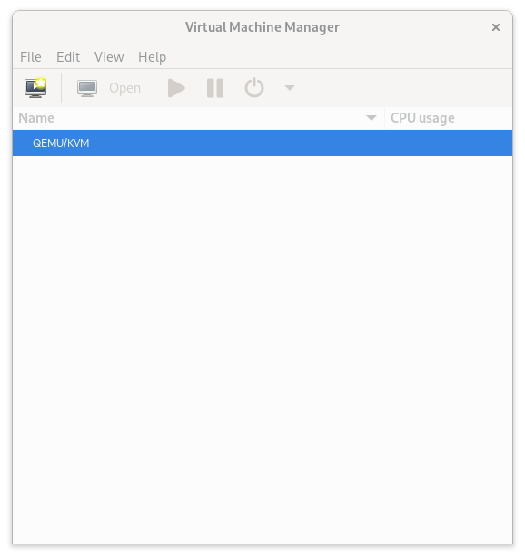

Double click on QEMU/KVM and then go into Virtual Network 

Click on the Virtual Networks tab and make sure that `On Boot` is not ticked. Then apply and go back


Click on the little computer screen


Make sure you've clicked local install media (ISO)


Click Browse and search for `/shared/vms/` and look for the ISO there. 


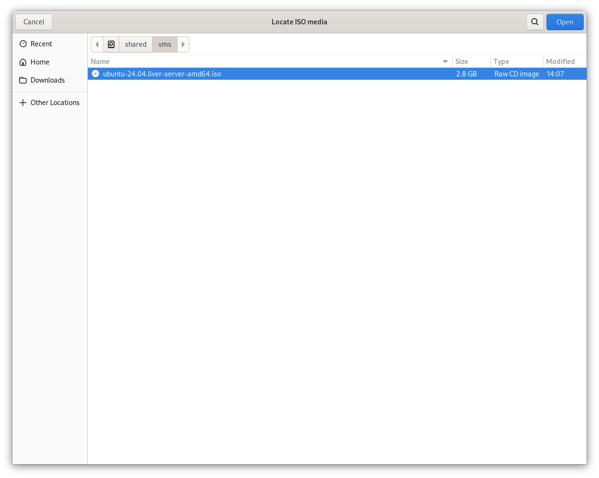

Click open then click Forward


Leave it at the default settings.


Same here 


Make sure you change the name to be your student number or some other identify. Don't be silly with it or I will delete it and you'll need to do it all again

I know my image says NAT but we probably need `bridge`

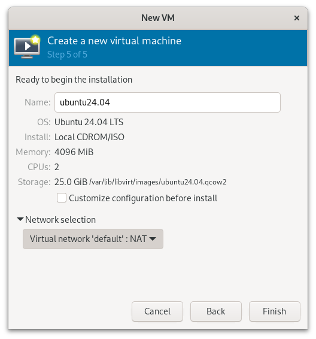


### Installing Ubuntu

It's time to try or install Ubuntu 


Keep default 

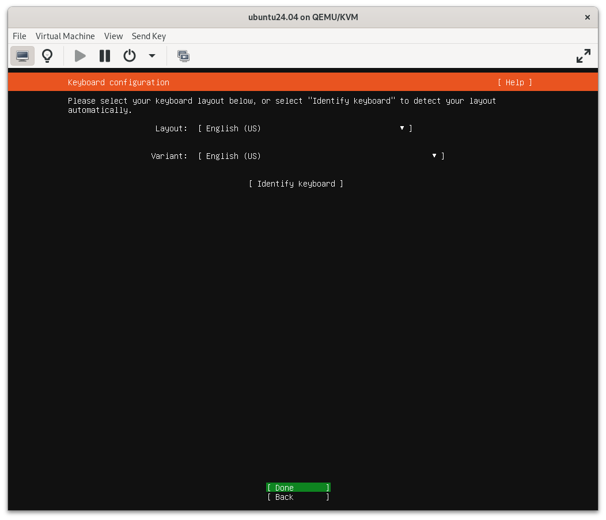


Select Minimised install


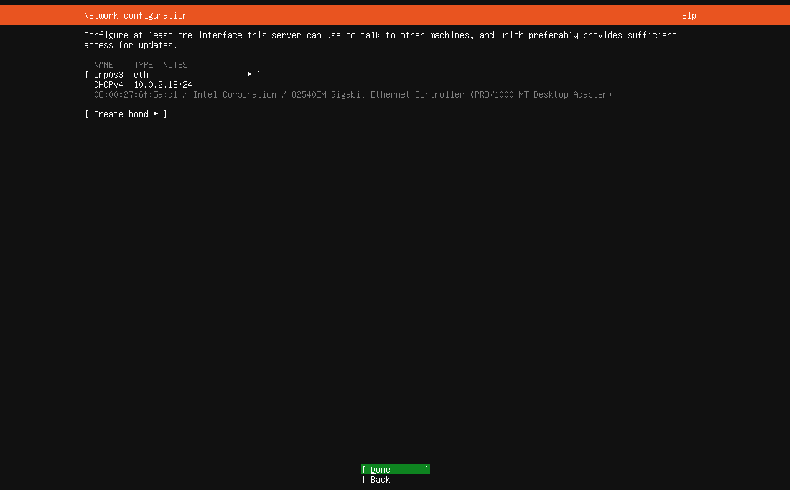


Keep default


Keep default

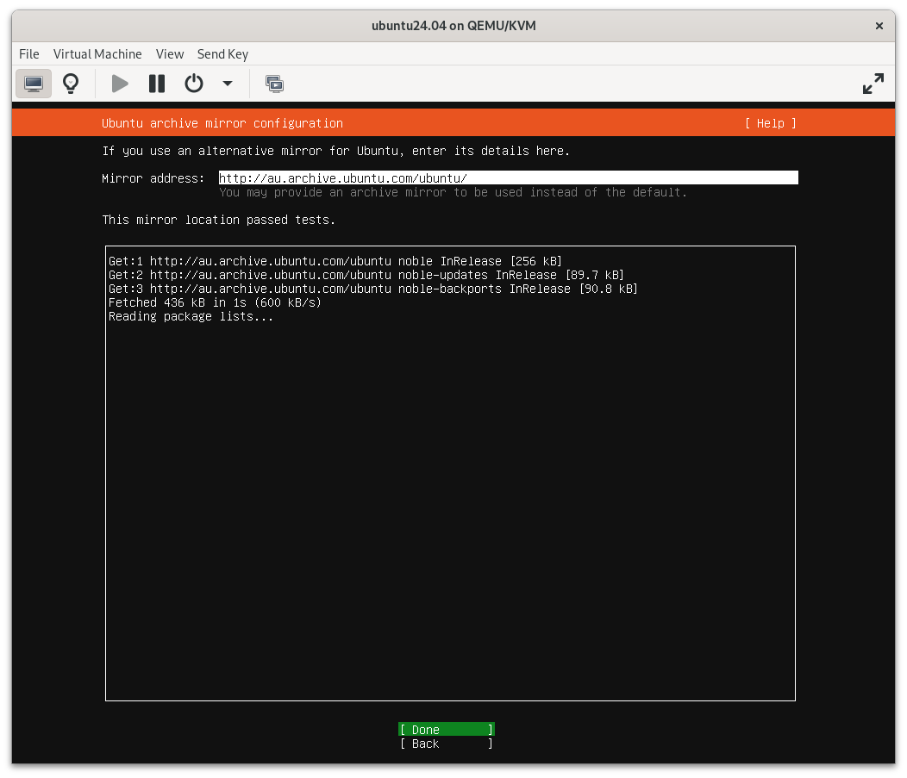

Keep default

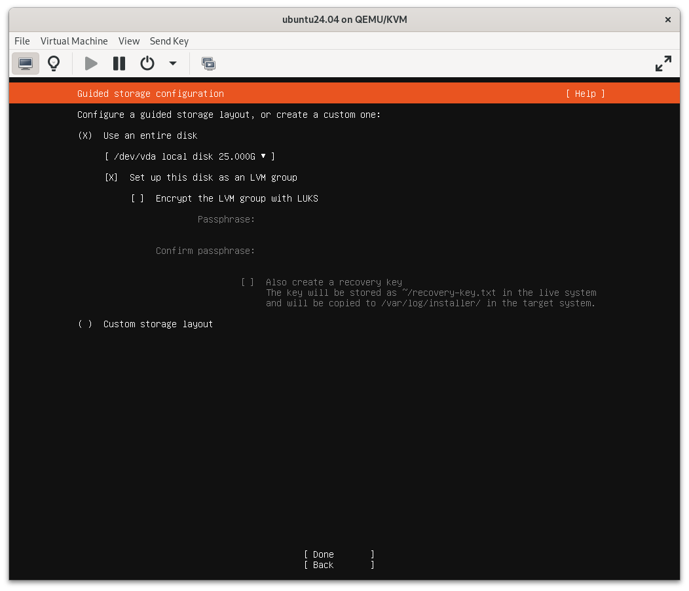

Keep default

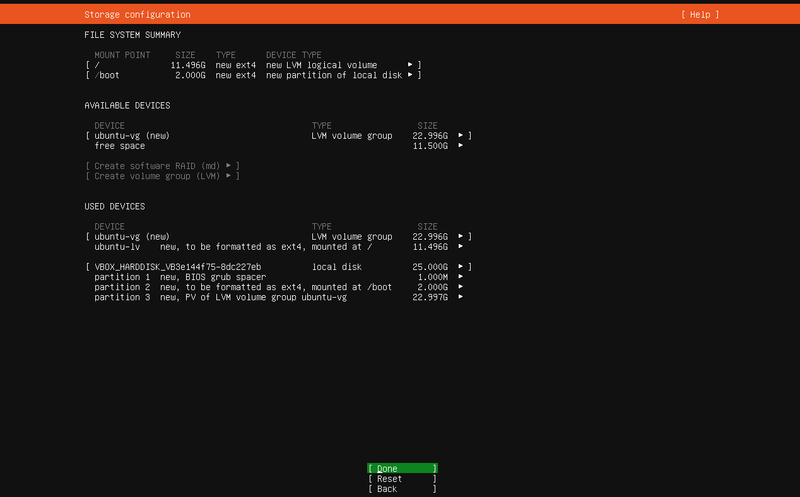

Everything is good, time to continue! 


Follow along. 

Although, please don't give yourself a little kid password. Use a big person password so your classmates don't hack you. 


Skip

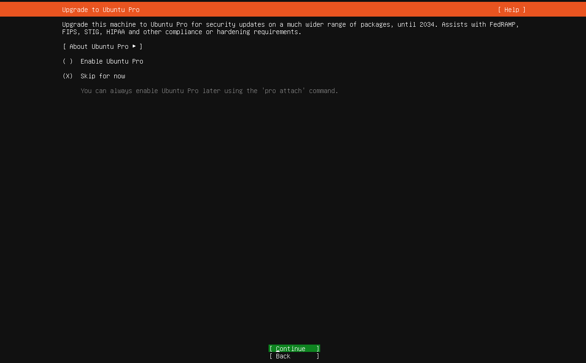

In a real world environment we would install OpenSSH server here, but we will do this manually so you know the steps. 

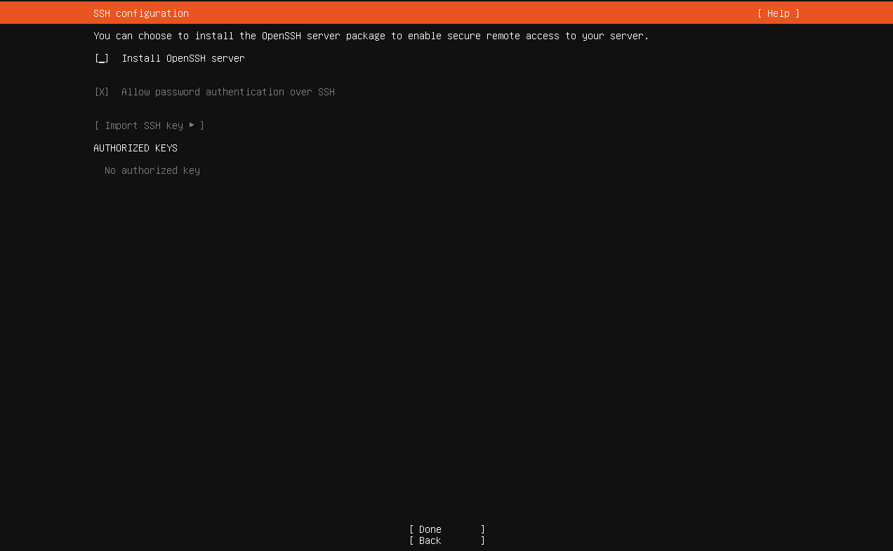


Don't select anything

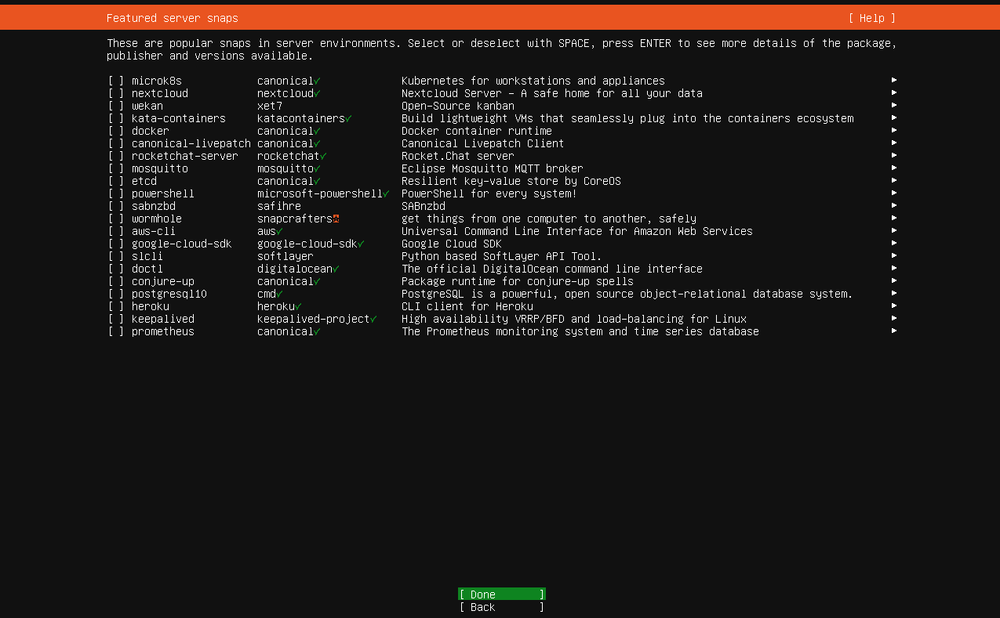

Watch it do it's thing

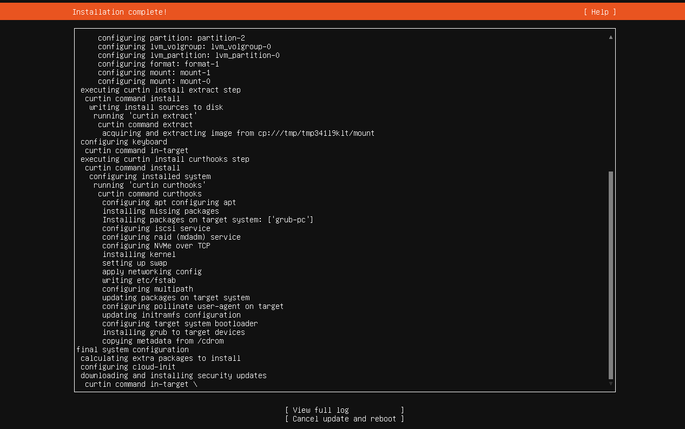

Reboot!

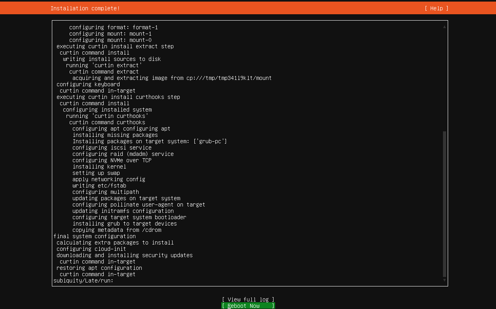

If the reboot fails, kill the session and restart it manually. 

### Configuring Linux

Log on with the credentials you provided


I have a feeling that we're in `shell` not `bash`

```bash
adam@monty:$
```

Often that dollar sign means our terminal session is shell. This means we are probably in shell (which is meh). Let's make sure we are not in bash

```bash
which bash
```

I got nothing

Let's change our terminal to bash (this gives his command history)

```bash
sudo chsh -s /bin/bash [username]
```

NOTE: You will probably be prompted to give your password because `sudo` means super user do

Next time we log in, we'll go to bash. However, let's do that for ourselves now. 

```bash
sudo bash
```

Let's make bash the default for new users

```bash
sudo nano /etc/default/useradd
```

(If this doesn't work, `sudo apt install nano` I'll explain it later)

Find the line that starts with `SHELL=` and change it to:

```text
SHELL=/bin/bash
```

### Installing ssh server

Before installing something new, let's make sure we have the most up to date packages 


```bash
sudo apt update
```

Because this is a pretty fresh install, it should be pretty quick 

Let's install openssh server. 

```bash
sudo apt install openssh-server
```

When prompted, press yes to continue 

Let's check to see the status of openssh 

```bash 
sudo systemctl status ssh
```


Let's install nano

```bash
sudo apt install nano
```

Now configure ssh server

```bash
sudo nano /etc/ssh/sshd_config
```

Find the line: `#Port 22` and change it to `port 2222`

Find the line `#PasswordAuthentication yes` and remove the `#`


Press `control + s` then `control + x` to save and exit

```bash
sudo systemctl enable ssh
sudo systemctl start ssh
sudo systemctl status ssh
```

So, what do we see? 

```bash
● ssh.service - OpenBSD Secure Shell server
     Loaded: loaded (/usr/lib/systemd/system/ssh.service; enabled; preset: enabled)
     Active: active (running) since Mon 2024-04-29 06:29:18 UTC; 1min 40s ago
TriggeredBy: ● ssh.socket
       Docs: man:sshd(8)
             man:sshd_config(5)
    Process: 751 ExecStartPre=/usr/sbin/sshd -t (code=exited, status=0/SUCCESS)
   Main PID: 753 (sshd)
      Tasks: 1 (limit: 4614)
     Memory: 4.2M (peak: 5.0M)
        CPU: 53ms
     CGroup: /system.slice/ssh.service
             └─753 "sshd: /usr/sbin/sshd -D [listener] 0 of 10-100 startups"

Apr 29 06:29:18 monty systemd[1]: Starting ssh.service - OpenBSD Secure Shell server...
Apr 29 06:29:18 monty sshd[753]: Server listening on :: port 2222.
Apr 29 06:29:18 monty systemd[1]: Started ssh.service - OpenBSD Secure Shell server.
```


Some key notes: 

```bash
Loaded: loaded (/usr/lib/systemd/system/ssh.service; enabled; preset: enabled)
```

This shows where the service is loaded from, if it is enabled, and if has started

```bash
Apr 29 06:29:18 monty sshd[753]: Server listening on :: port 2222.
``` 

Tell's us the port that it is running on

Let's find our IP address

```bash
adam@monty:~$ ip a
1: lo: <LOOPBACK,UP,LOWER_UP> mtu 65536 qdisc noqueue state UNKNOWN group default qlen 1000
    link/loopback 00:00:00:00:00:00 brd 00:00:00:00:00:00
    inet 127.0.0.1/8 scope host lo
       valid_lft forever preferred_lft forever
    inet6 ::1/128 scope host noprefixroute
       valid_lft forever preferred_lft forever
2: enp0s3: <BROADCAST,MULTICAST,UP,LOWER_UP> mtu 1500 qdisc pfifo_fast state UP group default qlen 1000
    link/ether 08:00:27:6f:5a:d1 brd ff:ff:ff:ff:ff:ff
    inet 192.168.1.132/24 metric 100 brd 192.168.1.255 scope global dynamic enp0s3
       valid_lft 86189sec preferred_lft 86189sec
    inet6 fe80::a00:27ff:fe6f:5ad1/64 scope link
       valid_lft forever preferred_lft forever
adam@monty:~$
```

So, I'm at home so my network is different to school. But here are the highlights: 

```bash
1: lo: <LOOPBACK,UP,LOWER_UP>
```

This is our local loopback. This allows us to access this machine by using either the IP address `127.0.0.1` or the word `localhost`

```bash
2: enp0s3: <BROADCAST,MULTICAST,UP,LOWER_UP>
```

This is a network card (enp0s3). 

This is `enp0s3`'s network IP address

```bash
inet 192.168.1.132/24
```

So, note that down somewhere. 

Let's exit terminal

```bash
exit
```

You should be thrown back to the login screen, right? 

Cool, on your computer press `alt`  and type terminal

Once in, log into your machine

```bash
ssh <username>@<ip-address> -p 2222
```

Mine is 

```bash
ssh adam@192.168.1.132
```


Type `whoami`

```bash
adam@monty:~$ whoami
adam
adam@monty:~$
```

Let's use our powers of sudo

```bash
adam@monty:~$ sudo whoami
root
adam@monty:~$
```

Okay, we are done for this session. If it's almost the end of the class can you shut this down? 

```bash
sudo shutdown now
```