# Installing Fedora Xfce

## Googling Fedora Xfce

["Googling Xfce"](./imgs/googling-image.png)

["found fedora xfce"](./imgs/goolge-results-image-1.png)


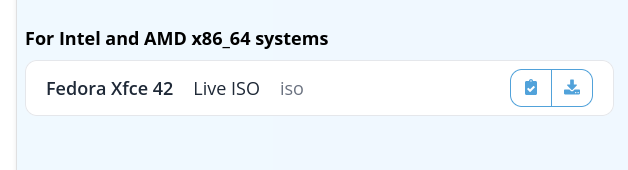

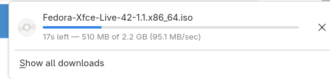

## Virtual manager


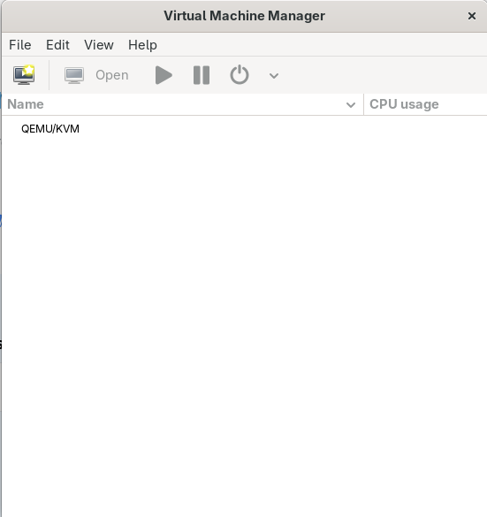

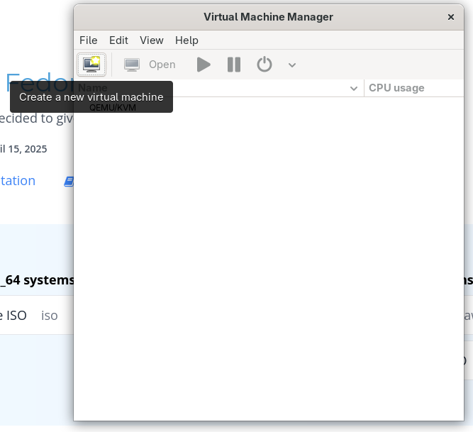

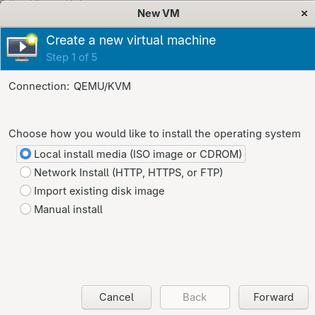

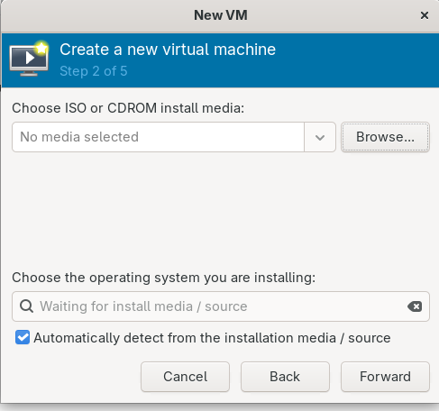

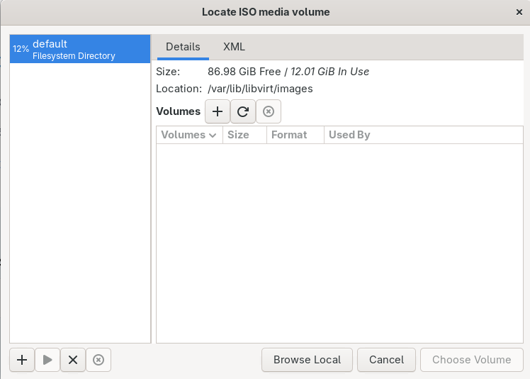

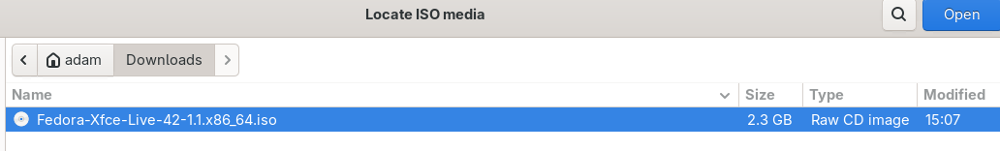

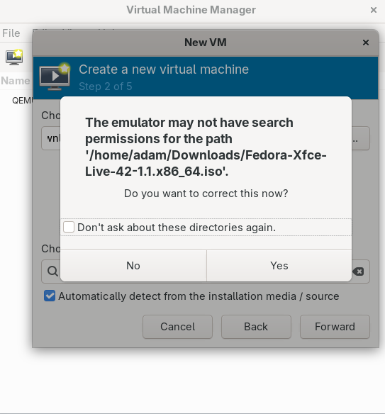

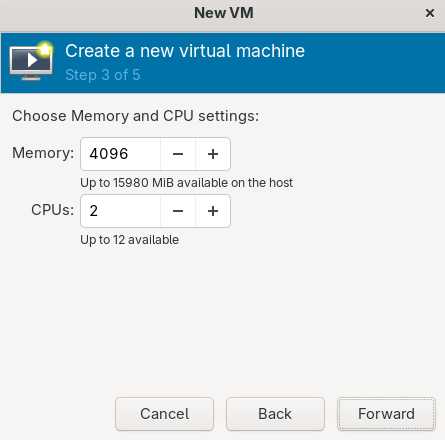

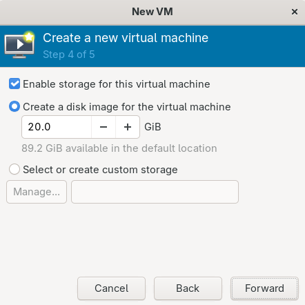

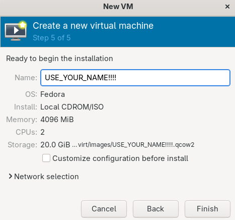

Start Fedora Live


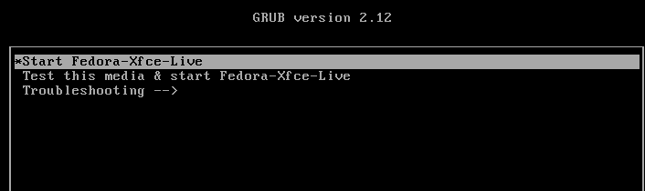

If it doesn't come up, install to disk 


Choose your language (Note: I can only read English). 

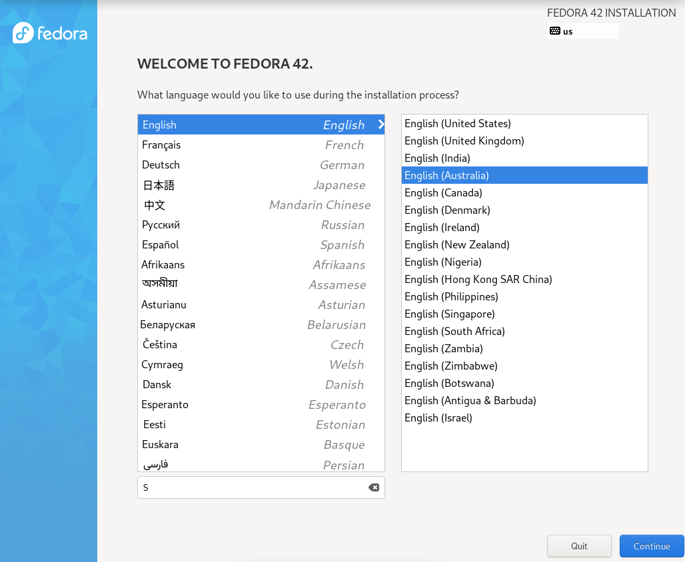

Click install destination


Immediately press done


Click User creation 


Enter in your details. Note, I can't fix your stuff if you forget your password

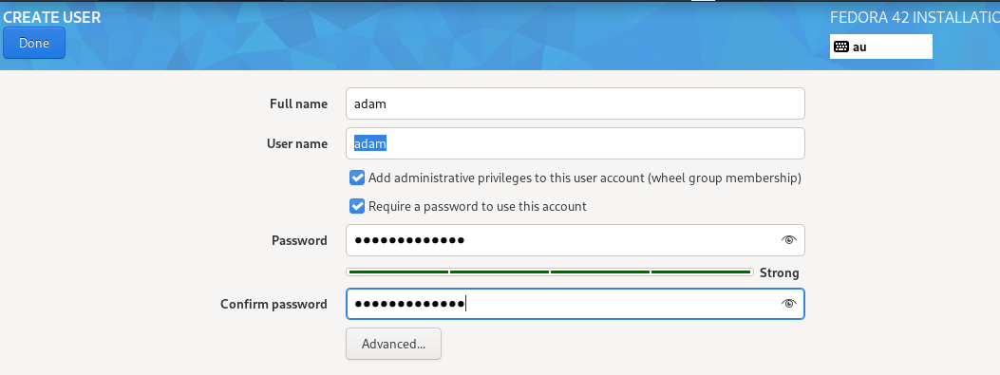

Begin installation

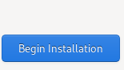

Wait a bit

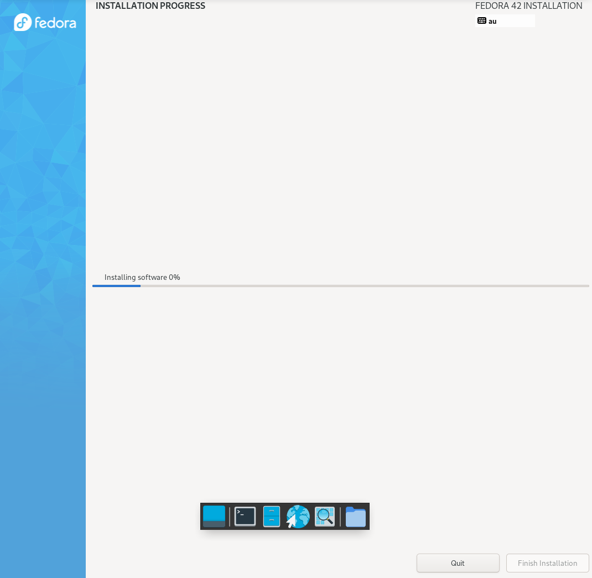

When the Finish Installation button goes blue, press it. 

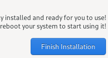

On my system, I had to reboot it. 

Log in

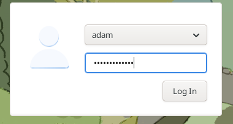

Let's update!

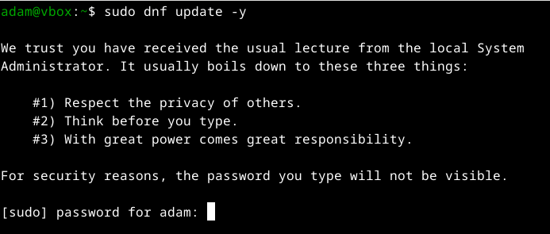


While that's happening, open up a new terminal and type the following commands: 

```bash
whoami
```

and 

```bash
groups
```

You should see something like 

```bash
whoami
adam
groups
adam wheel
```

Let's call your machine something else

```bash
sudo hostname awesomesauce
```


Let's install that second network card 

??? remind me to put this up